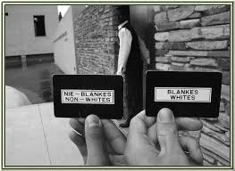

## The deliberate versus the unexpected

RELATED TERMS:

Contributed by Antonia Grant, Beverley White, Crona Connolly, Katie Russell and Yukie Nagasawa.

We looked at two examples of narrative environments: one a visitor experience tracking the history of apartheid in South Africa; and the other a playful urban intervention in Rotterdam.

The immersive experience of the Apartheid Museum in Johannesburg starts at the main gate where the visitor is randomly assigned a “white” or “non-white” status on their ticket. Separate doors for each ticket class lead visitors into the exhibit, an action which gives a sense of the experience of living through Apartheid.

In what becomes a very personal, emotive journey, the visitor is taken out of their comfort zone, not knowing what to expect or when they will be reunited with the people they came with.

In this narrative experience, the audience has made a conscious decision to visit and learn about Apartheid and have dedicated a set amount of time to engage with the exhibits.  

A contrasting example is “Body Movies – Relational Architecture No. 6” a large scale interactive public projection by Rafael Lozano-Hemmer screened in 2001, in Schouwburgplein, Rotterdam. An example of urban play, this piece invites passers-by to interact with the screen and fellow users of the square. The audience engage either by actively participating or by passively observing the actions of others. 

In comparison to the Apartheid Museum, the audience still adopt a role but it is optional and unexpected. The strength in both lies in the immersive quality of the narrative and the opportunity for visitors to assume a role in the story.

