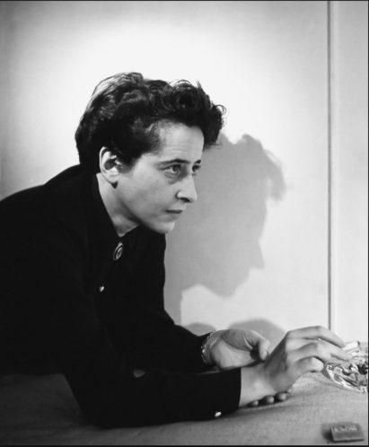

## Arendt

For lengthier discussions of the value of Hannah Arendt for narrative environment design, see [Arendt, phenomenology and narrative environments](http://prolepsis-ap.blogspot.co.uk/2017/06/arendt-phenomenology-and-narrative.html) and [Addenda: Arendt, phenomenology and narrative environments](http://prolepsis-ap.blogspot.co.uk/2017/09/addenda-arendt-phenomenology-and.html)

Why is the writing of Hannah Arendt, 1906-1975, important for the design of narrative environments?

It is important because she focuses on the active life in its many aspects: we labour, we work, we act and we think or judge, as she puts it. She has a distinct political phenomenology of action that emphasises spatial, perceptual and performative relations; and, within that phenomenology of action, she has a distinctive interest in storytelling and narrative. All of those aspects are important when considering the design of a narrative environment and Arendt’s thinking permits an opening towards a performative conception of the relations among narrative, environment and human elements of the overall design.

Why does her thinking need to be critiqued and extended?

Her thinking needs to be critiqued and extended because she might seem to treat labour, work, action and thinking/judging as separate spheres in a strict hierarchy, with (political) action at the top, framing thinking/judgment. She might seem to propose an elitist and anti-egalitarian concept of politics, restricting freedom of action to a limited group of wealthy men (heads of households). Also, she might seem to propose that the sole content of politics is politics itself, as speech or exchange of views, to the exclusion of social or economic policies.

Her work needs to be extended in the direction of allowing these categories to be seen to flow through one another, by means of the bodies and environments that constitute the intersubjective and intercorporeal, or ‘worldliness’ in Arendt’s terms. Rather than the material world being simply the product of work or fabrication, it takes part in articulating labour/life and action/politics and the relations among labour/life, work/world and action/politics. A narrative environment is a domain, a ‘space of appearance’ in Arendt’s terms, of such intersubjective, intercorporeal ‘worldliness’. A dynamic, fluid model of the relationships among labour, work, action and thinking/judging, drawing upon the body in its intercorporeal constitution, a direction opened up by Judith Butler, for example, is needed.

Why does Arendt place such emphasis on the active life, as labour, work, action and thinking/judging?

She creates her categories as part of a process of reversing or inverting the ascendancy of the _vita contemplativa_ (contemplative life) over the _vita activa_ (active life). She perceives the contemplative life, as a withdrawal from action, to have been in the ascendant in Western thinking since Plato, an emphasis strengthened by Christianity, with its notion of ‘otherworldliness’ and postponed gratification or ‘realisation’. Arendt stresses the ‘thisworldliness’ of human reality through labour, work and action. This places her alongside Marx, Nietzsche and Heidegger, each of whom emphasises the active life, although in different ways, and puts the human body at the centre of thought/judgment.

Another purpose in creating her categories is that they provide a means for her to critique Marxian thought about labour, work and action, as the constituents of the vita activa. She seeks to undo what she sees as Marx’s overestimation of the value of labour and work and his underestimation of the value of action, as politics or political action.

Arendt, on the one hand, is critical of the contemplative life. Instead, she proposes a thoughtful life, closely related to action. On the other hand, she is critical of the active life reduced solely to labour and work. Instead, she emphasises the importance of the political life, as action.

_Vita activa_ is Arendt’s interpretation of the Greek notion of _praxis_, a notion that came to her attention through the work of Heidegger. It is a notion that is also developed by Marx. However, according to Arendt, Marx is mistaken to see the pinnacle of human life as the expression of labour, through which humans come to recognise themselves and their value. Instead, she proposes action as the means whereby humans disclose themselves to one another through word and deed in a specific space of appearance constituting the public realm/public space.

It is this notion of a ‘space of appearance’, constituted through (political) action, which sustains freedom of action, that is of great significance for thinking about the kind of environment, as a ’space of appearance’, that any specific narrative environment can be said to bring into existence.

What does Arendt conceive of as being authentically political?

Arendt’s examples of moments of the authentically political are Greek city states, as well as Greek (tragic) theatre; the Roman _res publica_; the American Revolution; the French Revolution; the working-class rebellion in Europe from 1848 to the 1930s, particularly the workers’ councils; and, later in her life, the American civil disobedience of the 1960s. For Arendt, “politics is all the more authentic when it is eruptive rather than when it is a regular and already institutionalised practice” (Kateb, 2000: 134-135).

She focuses on these positive examples in order to draw out what she considers to be deeply problematic in the negative examples of German Fascism and Soviet Communism, which she characterises as ’totalitarian’.

The work of Hannah Arendt is useful for considering whether any specific narrative environment acts politically and in what sense it might be argued to do so. This engagement with Arendt’s thought, like that with any other theorist, requires an understanding of both her value and her limitations in conceiving action and the political.

**References**

Kateb, G. (2000). Political actions: its nature and advantages. In _The Cambridge Companion to Hannah Arendt_, edited by Dana Villa. Cambridge, UK: Cambridge University Press.

**Selected Reading List**

Arendt, H. (1958) _The Origins of totalitarianism_. 2nd edn. Cleveland and New York: Meridian Books.

Arendt, H. (1998) _The Human condition. introduction by Margaret Canovan_. 2nd edn. Chicago, IL: University of Chicago Press.

Arendt, H. (2005) _The Promise of politics_. Edited by J. Kohn. New York, NY: Schocken Books.

