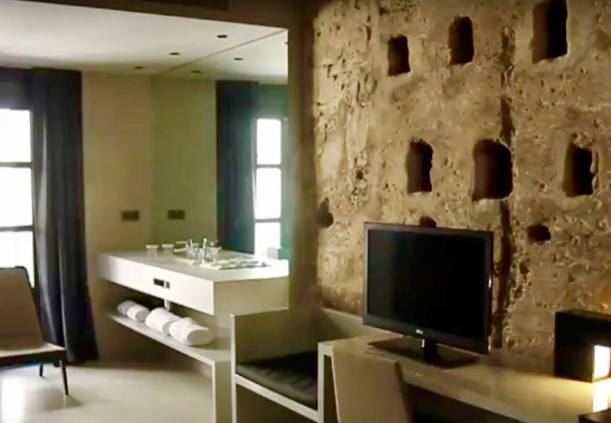

## Caro Hotel, Valencia, Spain

RELATED TERMS:

**The Caro Hotel, Valencia, Spain, proposed by Eve Chokechalermwat, November 2017**

The refurbished Caro Hotel in Valencia, Spain is housed in a structure that contains a well-preserved Arabic Balansiya wall from the 12th century. The structure has been modified many times over the centuries, the most recent, prior to the hotel, being a 19th century palace.

The architect, Francesc Rifé Studio, who designed the hotel has kept elements from different periods of the building’s history, integrating centuries-old structures with modern decor, using this bricolage as the basis for the creation of stories. Each of the 26 rooms is different from the others, and has its own story related to the past, for example, The Marquis’s Study, the Cat’s Room and the Wall Room. Tags and QR codes are used to describe each of the historic elements and its role in the particular story.

Situated in a building declared Heritage of Cultural Interest, [the hotel’s website](https://www.carohotel.com/en/) claims that it is the only historical monument-hotel in Valencia. As a narrative environment, the hotel over-writes the narrative of the contemporary visitor’s journey with the historical journey that the building itself has undergone, highlighting the temporality of place as well as its spatial arrangements, which allows the building serve as a kind of material cultural palimpsest.

