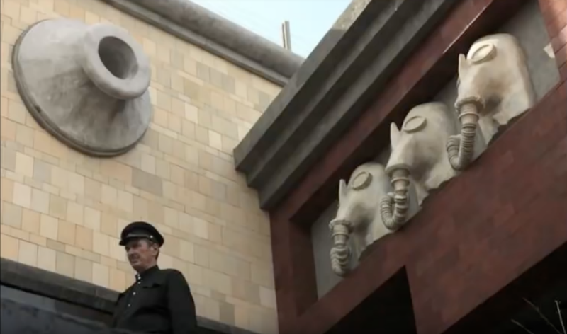
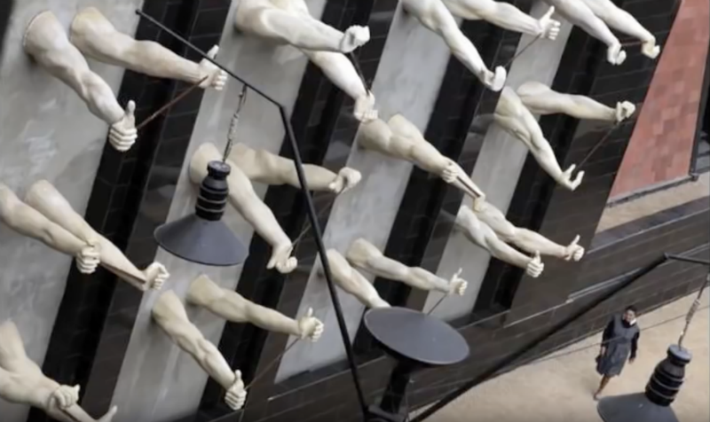

## Dau Project

**RELATED TERMS: Realism; World, World of the Story and World of the Narrative Environment**

An interesting question for the narrative environment designer is: to what extent was the _Dau_ project, enacted in 2009-2011, and reiterated in 2019, a narrative environment? It also raises, obliquely, the question of the boundaries between (voluntary) ‘participation’ and ‘subjection’ particularly, as in this case, in a fictional reconstruction of an oppressive regime where the participants enact the subjection in a recursive cycle.

The _Dau_ project brought into existence a fictional world that sought, as an experimental art piece, to blur the distinctions between art and life. The project was initially conceived by the Russian film director Ilya Khrzhanovsky in Moscow in 2005 as a film about the Soviet physicist Lev Landau. The project title, _Dau_, is an abbreviation of Landau’s surname. However, what was initially conceived as a biographical portrait of a physicist transformed into a ‘staged reality experience’ when Khrzhanovsky decided  that Landau’s life story was too large and potent to be confined to a conventional narrative.

In 2009, Khrzhanovsky built a huge sealed set in the northeastern Ukrainian city of Kharkiv, where Landau worked and taught in the 1930s. The film’s set, which became a cult of historical verisimilitude, was known locally as ‘the Institute’. It was built in Kharkiv’s derelict outdoor swimming pool complex, which offered a natural courtyard surrounded by low Stalin-era buildings.

In the process, the constructed environment became less a film set than a parallel world. It functioned as a mini-state, trapped in the period 1938-1968, sealed off from the contemporary world outside it. This world was populated with hundreds participants, some actors, some non-actors, some celebrities, some scientists, who lived as faithfully as possible as Soviet citizens of the time. The obsessive drive for period authenticity went into such details as clothes, hairstyles, food packaging, cigarette brands, and so on. As well was having a spatial existence, time also moved forwards inside Dau’s world. As it passed from 1938 to 1968, the period detail was continually updated (Rose, 2019).

 

James Meek (2015) summarises concisely the events of this ‘staged reality’, “For more than two years, between 2009 and 2011, hundreds of volunteers, few of them professional actors, were filmed living, sleeping, eating, gossiping, working, loving, betraying each other and being punished in character, in costume, with nothing by way of a script, on the Kharkiv set, their clothes and possessions altered, fake decade by fake decade, to represent the privileged, cloistered life of the Soviet scientific elite between 1938 and 1968.”

The strangest aspect of this project was that only a tiny proportion of this daily living was actually filmed. It was not like a giant Big Brother house. There were no hidden cameras. A single cinematographer, Jürgen Jürges, roamed the set with a three-person crew. Between 2009 and 2011, he filmed 700 hours of footage, a very small amount, considering the two-year duration of the “experiment”. The rest of the time, people went about their Soviet business, unobserved.

Some of the nature of Dau’s realism or verisimilitude can be gleaned from the casting. Dau’s man-child son is played by Nikolay Voronov, who turns out to be a Ukrainian YouTube star. Sasha and Valera, two gay lovers in the Dau world, were formerly homeless people. The mother of Nora, Landau’s wife, is played by Lidiya who is the real-life mother of the Russian actor, Radmila Shchyogoleva, who plays Nora.

As expressed by, Teodor Currentzis, one of the points of participating in this experiment is how to be yourself and yet not to be yourself at the same time. You are in an environment that you know is a game, but it does not work if you are not also yourself. Indeed, so successful was this ‘immersion’, this double articulation of one’s game-participant self and one’s ‘real self, that when leaving the world of Dau and re-entering the outside world, the participants felt it was like visiting another time. The real world became like a stage or film set to them.

The Dau experiment in Kharkiv ended definitively in November 2011, when Khrzhanovsky ordered the destruction of the Institute. According to a report in Kommersant, the director hired a group of real-life Russian neo-Nazis to storm the set, destroy it and performatively enact a massacre of its staff.

From the seven hundred hours of footage shot in Kharkiv of the myriad threads of an ultra-elaborate artistic experiment, editors in London were said to be fashioning a dozen or more movies, a television series, and a user-directed internet narrative system. Finally, in October 2018, the film, _DAU Freiheit_, or _DAU Freedom_, is to be shown to the public for the first time at an art installation in Berlin.

However, it may be that , as James Meek concludes, “the significance of a representative spectacle was, perhaps, most fully realised in the emotions of those who enacted it, rather than those who will merely witness its two-dimensional, unscented, intangible afterglow on a flat screen”, which raises the issue of the different kinds of ‘immersion’ that are possible for narrative environments, immersion in a cinema diegese and narrative being different from that of theatre and theatre being different from that of a ‘staged reality experience’.

To rekindle that degree of significance for the visitor to the installation, Mark Brown reports that a large section of the Berlin Wall will be rebuilt on Unter den Linden boulevard, creating a walled-in city within a city. Before entering this city, visitors will have to buy ‘visas’ online and hand over their phones. The project will end with a ritualistic tearing down of the wall on 9 November 2018, exactly 29 years after the event in 1989.

A report on the project by Alina Simone can be heard here: [https://www.youtube.com/watch?v=wWwf_uvcsCk](https://www.youtube.com/watch?v=wWwf_uvcsCk)

A review of the Parisian version of the Dau project, which opens in early 2019, can be seen below from the programme _Encore_

<iframe src="https://www.youtube.com/embed/0Bzg5nelgDA?start=45" width="560" height="315" frameborder="0" allowfullscreen="allowfullscreen"></iframe>

**References**

Brown, M. (2018). Stalinist Truman Show: artist paid 400 people to live as Soviet citizens. _Guardian_, 1 September. Available from [https://www.theguardian.com/world/2018/aug/31/stalinist-truman-show-artist-paid-400-people-to-live-as-soviet-citizens](https://www.theguardian.com/world/2018/aug/31/stalinist-truman-show-artist-paid-400-people-to-live-as-soviet-citizens) [Accessed 2 September 2018].

Meek, J. (2015). Diary. _London Review of Books_, 37 (19), 42-43\. Available from [https://www.lrb.co.uk/v37/n19/james-meek/diary](https://www.lrb.co.uk/v37/n19/james-meek/diary) [Accessed 2 September 2018].

Rose, S. (2019). Inside Dau, the ‘Stalinist Truman Show’: ‘I had absolute freedom – until the KGB grabbed me’. _Guardian_, 26 January. Available from [https://www.theguardian.com/film/2019/jan/26/inside-the-stalinist-truman-show-dau-i-had-absolute-freedom-until-the-kgb-grabbed-me](https://www.theguardian.com/film/2019/jan/26/inside-the-stalinist-truman-show-dau-i-had-absolute-freedom-until-the-kgb-grabbed-me) [Accessed 27 January 2019].

