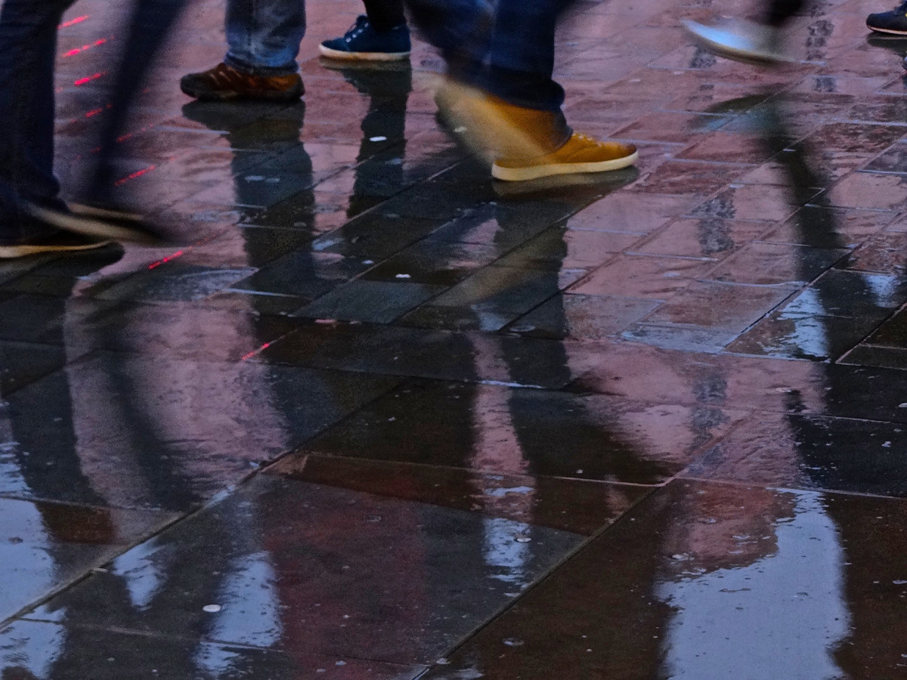

## Everyday

**RELATED TERMS: Dasein; Lifeworld, Lebenswelt, Umwelt; Modernism; Feminism - Material feminism; ; Xu Zhen Supermarket; Heidegger; Lefebvre**

the everyday – le quotidien – Alltaglich

In some respects, narrative environment design could be considered to be a critical, creative and reflexive practice within and about everyday life, interested not just in the ordinary but also the extraordinary. However, at first, it might not seem that the everyday is fertile ground for narrative environment design, particularly if, for example, one begins from the proposition articulated by Maurice Blanchot (1987: 17) that,

“The everyday, where one lives as though outside the true and the false, is … without responsibility and without authority, without direction and without decision, a storehouse of anarchy, since casting aside all beginning and dismissing all end. This is the everyday.”

Yet if one is attentive to Blanchot’s qualification, that it is “as though” this is the case, then it can be seen that the issues with which narrative environment design is concerned are indeed present in the everyday: truth and falsehood or authenticity and inauthenticity; responsibility and authority; direction and decision-making; order and disorder; beginning and ending.

The everyday, everyday life or daily life, is the banal, the quotidian, the obvious, the common, the ordinary, the habitual (Perec, 2008), that which is taken for granted, that which all too familiar and therefore goes unnoticed and is overlooked. The everyday is that which slips into the background; or, as Maurice Blanchot (1987: 12) puts it in an essay section heading, “The Everyday: What is Most Difficult to Discover”.

Agnes Heller (1985), from a different perspective, suggests that the everyday might be understood as the most fundamental ontological category of society, albeit one that is not an unchanging essence but has to be continually re-constructed. For Heller, the everyday constitutes the shared life experience through which the world is intersubjectively constituted.

In terms of an actantial model of narrative environments, the everyday environs; that is its primary mode of actantiality: it becomes an unrecognised and unrecognisable part of the atmosphere, unless disrupted and brought (back) to attention.

For this reason, the everyday may be of great significance in thinking about the design of narrative environments because, similarly to the interventions of neo-avant-garde artists, a narrative environment can provide a way of “ensuring that the details of everyday life, the random constellations of objects that surround us, stop going unnoticed”, as George Brecht, conceptual artist and member of Fluxus, expressed it. Appropriating Zen and other forms of Mahayana Buddhism for their own ends, the work of neo-avant-garde artists and composers, such as the ‘anti-art’ of George Maciunas, a central figure in Fluxus, and the ‘situation art’ of Tom Marioni, rejected orthodox modernism in favour of the sheer immediacy and authenticity of everyday life.

Everyday life is a central, highly diverse and problematic theme for modern philosophy and social theory and, since the mid-1990s, has become persistent topic within art practice. The analysis of the everyday has been undertaken by such thinkers as Dilthey, Wittgenstein, Simmel, Husserl, Schutz, Heidegger, Dewey, Lefebvre, Kosik, Bakhtin, Benjamin, Bloch, Habermas, Garfinkel, Debord and de Certeau.

As Lefebvre (2014: 679) points out, this represents a radical change of focus for philosophy, because,

“In the past, philosophers excluded daily life from knowledge and wisdom. Essential and mundane, it was deemed unworthy of thought. Thought first of all established a distance (an epoche) vis-a-vis daily life, the domain and abode of non-philosophers.”

By changing its focus thus, Lefebvre suggests, philosophy is seeking to renew itself by overcoming speculative abstraction, an endeavour which has been ongoing since Marx, Husserl, Heidegger, Lukacs and others.

As Gardiner (2006: 207) highlights, the theorists mentioned above set out to problematise everyday life, to expose its manifold contradictions, effects and determinations, as well as its hidden potentialities. This problematisation is accomplished through various techniques of the [alienation effect](http://compendium.kosawese.net/practice/alienation-effect/), estrangement or [defamiliarisation](http://compendium.kosawese.net/practice/defamiliarisation-ostranenie-or-making-strange/) whose aim is to unsettle the state of habitualised, perpetual distraction that, it is argued, constitutes the everyday life of modernity, thereby jolting it into a condition of active awareness or mindfulness.

Such approaches, therefore, differ from mainstream sociological studies, in which the everyday is the realm of the ordinary. In the alternative sketched out by Lefebvre and others, the everyday is treated as incipiently extraordinary. As Gardiner (2006: 207) explains,

“The ordinary can become extraordinary not by eclipsing the everyday, or imagining we can arbitrarily leap beyond it to some ‘higher’ level of cognition, knowledge or action, but by fully appropriating and activating the possibilities that lie hidden, and typically repressed, within it. Such an enriched experience can then be re-directed back to daily life in order to transform it.”

In line with the Marxian dictum in the _Theses on Feuerbach_, the goal is to elevate lived experience to the status of a critical concept, not simply in order to describe it, but in order to change it (Kaplan and Ross, 1987: 1). The French understanding of the everyday, Schilling (2003: 24) comments, incorporates the avant-garde injunction to “change life” which runs through the left-wing politics of Lefebvre, the disruptive interventions of the Situationist International and the popular tactics of resistance articulated by De Certeau and which was adapted by the Surrealists from Rimbaud and Marx.

Everyday life undoubtedly does display routinised, static and unreflexive characteristics, as Schütz and other sociologists have noted. Nevertheless, the work of Lefebvre and others leads to the recognition that everyday life is also capable of surprising dynamism, penetrating insight and unbridled creativity. Everyday lives and knowledges thus demonstrate an irreducibly imaginative and dynamic quality. They cannot simply be written off as trivial, inconsequential and habit-bound (Gardiner, 2006: 207). In this sense, the French-derived thinking about the everyday differs from German-language reflections on Alltaglichkeit, such as in Lukacs’ _Metaphysics of Tragedy_ and Heidegger’s _Being and Time_, which characterise the everyday as the domain of inauthenticity, tiriviality and error (Schilling, 2003: 24).

Michael Sheringham (2006: 3) emphasises the importance of French thought in the post-World War Two period (post-1945) in bringing the notion of the everyday, or the quotidien, to prominence. He argues that from the mid-1950s onwards a cluster of closely-related ways of thinking about and exploring the everyday developed which led to the notion of the everyday being positioned at the centre of French culture from the 1980s onwards, and into the 21st century. Since the 1980s, investigations and explorations of the everyday have become prominent in France certainly, but also elsewhere.

Prominent amongst those paying attention to the everyday in the French context are Henri Lefebvre, Roland Barthes, Michel de Certeau and Georges Perec, in dialogue with such thinkers as Edgar Morin, Jean-Luc Godard, Pierre Bourdieu, Michel Foucault and those included under the banner of Situationism. In turn, these writers draw common inspiration from ideas about the everyday at large in the writings of Karl Marx, Georges Bataille, Michel Leiris, Raymond Queneau and Walter Benjamin, as well as the Surrealists (Sheringham, 2006: 4).

Thus, the work of critical neo-Marxist writers, such as Guy Debord, Henri Lefebrvre, the early Jean Baudrillard and Edgar Morin, articulating a ‘critique of everyday-life’, formed a unique contribution to the construction of a sociology of the quotidian, which examined everyday life as a site of capitalist domination characterised by ‘alienation’, ‘reification’ and ‘commodity fetishism’, or what Debord called the ‘society of the spectacle’ (Evans, 1997:223).

For Marx, the everyday is the site of political struggle, towards which philosophy should direct its attention; and is also the object of critique in certain forms of literary studies, as noted by Gayatri Chakravorti Spivak (2002: 30):

“In Marx’s text philosophy must thus displace itself into the everyday struggle. In my argument, literature, insofar as it is in the service of the emergence of the critical, must also displace itself thus.”

In being conceptualised as a site of struggle, i.e. within an agonistic framework, the everyday can be understood narratively as a set of dramatic conflicts taking place in specific environments for specific kinds of actants and, therefore, thinking about the everyday is of interest in the design of narrative environments.

Brooker (2003: 96-97) suggests that references to everyday life can be taken to express an emphasis upon the forms and meanings of a common or popular culture. The assumption behind this position is that, as Raymond Williams argues, culture is ordinary, rather than the exclusive province of an elite. In turn, this underlies a broadly political perspective on cultural production and consumption, enabling the routine or banal in daily life to be recognised as a complex field of contested cultural meanings.

If, as Maurice Blanchot (1987: 13) suggests, the everyday constitutes, “a utopia, and an Idea, without which one would not know how to get at either the hidden present, or the discoverable future of manifest beings”, then the task of the narrative environment designer, as critical theorist of everyday life, becomes that of practising a utopian humanism.

Such a practice celebrates the intrinsic, although often invisible, promises and possibilities of ordinary human beings and the inherent value of common sense forms of making sense and knowing. It also recognises, nonetheless, the shortcomings of the mundane world as currently constituted. It is therefore attuned to the transgressive, sensual and incandescent qualities of everyday existence, whereby the whole fabric of daily life, in its sociality, materiality, spatiality and temporality, can take on a festive character, akin to that of a work of art (Gardiner, 2006: 207).

Good places to start researching how the study of everyday has developed are:

[Cultural Studies, volume 18, issue 2/3, 2004](http://www.tandfonline.com/toc/rcus20/18/2-3), and

[Yale French Studies](https://www.jstor.org/stable/i347899), no. 73, 1987.

_See also_ the entry for [Situationist International](http://compendium.kosawese.net/practice/situationist-international/)

See also [Painting the everyday](http://www.europeana.eu/portal/en/exhibitions/painting-modern-lives/painting-the-everyday#ve-anchor-intro_3803-js) in [Europeana](http://www.europeana.eu/portal/en)

**Selected readings**

Blanchot, M. (1987). Everyday speech. _Yale French Studies,_ 73, 12–20.

Brooker, P. (2003). _A Glossary of Cultural Theory_, 2nd ed. London, UK: Arnold.

Evans, D. (1997). Michel Maffesoli’s sociology of modernity and postmodernity: an introduction and critical assessment. _Sociological Review_, 45 (2), 220–243\. Available from http://doi.wiley.com/10.1111/1467-954X.00062 [Accessed 7 May 2016].

Heller, A. (1985) _The Power of Shame: A Rational Perspective_. London: Routledge and Kegan Paul.

Johnstone, S., ed. (2008). _The Everyday_. London: Whitechapel Gallery

Lefebvre, H. (1995). _Critique of everyday life. Volume 1: Introduction._ London, UK: Verso.

Lefebvre, H. (2014). Critique of everyday life. Volume III: From modernity to modernism (towards a metaphilosophy of daily life). In: _Critique of everyday life. The one-volume edition_. London, UK: Verso.

Gardiner, M.E. (2006). Everyday knowledge. _Theory, Culture & Society_, 23 (2-3), 205–207\. Available from http://dx.doi.org/0.1177/026327640602300243 [Accessed 6 May 2016].

Perec, G. (2008). _Species of spaces and other pieces_. London, UK: Penguin Books.

Sandywell, B. (2004). The Myth of everyday life: toward a heterology of the ordinary. _Cultural Studies_, 18 (2), 160–180.

Schilling, D. (2003). Everyday life and the challenge to history in postwar France: Braudel, Lefebvre, Certeau. _Diacritics_, 33 (1), 23–40\. Available from http://www.jstor.org/stable/3805822 [Accessed 7 May 2016].

Sheringham, M. (2006). _Everyday life: theories and practices from Surrealism to the present_. Oxford, UK: Oxford University Press.

