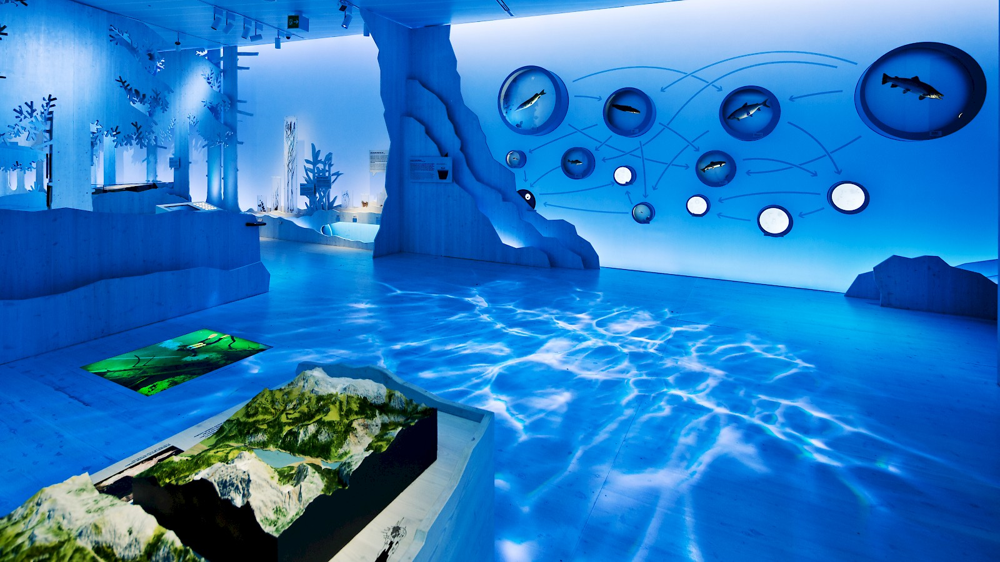
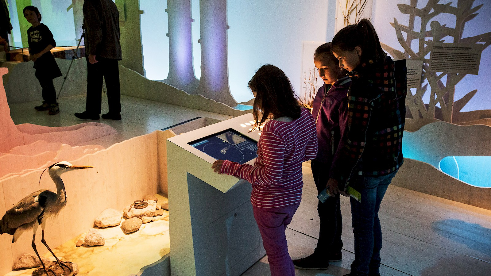
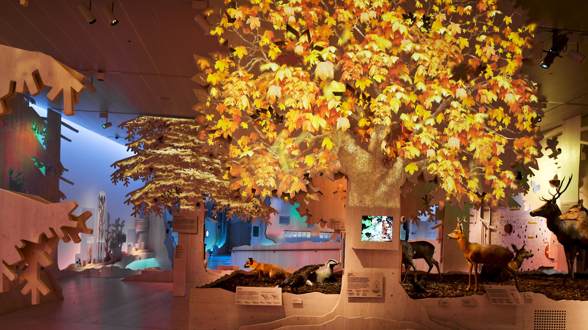

## Haus der Berge, National Park Centre Berchtesgarden

RELATED TERMS: 

Contributed by Leah Naganao

This media exhibition in the middle of the south German nature and mountains is intriguing the visitor to learn and explore the real nature. This permanent exhibition of Haus der Berge, at the national park center in Berchtesgaden dedicates three minutes for each season, showing the beauty and diversity of animals and plants, landscapes of Berchtesgaden. In 3 minute-intervals the whole museum changes its seasonal atmosphere.

Also the museums subject areas are divided into different biotopes that can be found in the nature outside, giving the visitor material and new ways to learn about it and explore.

The media installations and graphic panels let the visitor go above and under water, the awe-striking perspectives travel through the four seasons along pastures, forests and over the snowy summits of the national park. Visitors can experience interviews with local mountain farmers or the biodiversity of the native flora and fauna at the various interactive media stations.

The media installations do not intend to imitate nature, but far more offer exceptional perspectives of the national park Berchtesgaden and insights into its micro worlds.

The visitor takes a route inside the museum that is having its climax at the top of the Alps for a special media highlight: a 10 x 15 meter spatial projection installation that opens up to the real life panorama of the Alps.

project link: [http://tamschick.com/en/projects/national-park-centre/](http://tamschick.com/en/projects/national-park-centre/)  
vimeo video link: [https://vimeo.com/82197175](https://vimeo.com/82197175)

