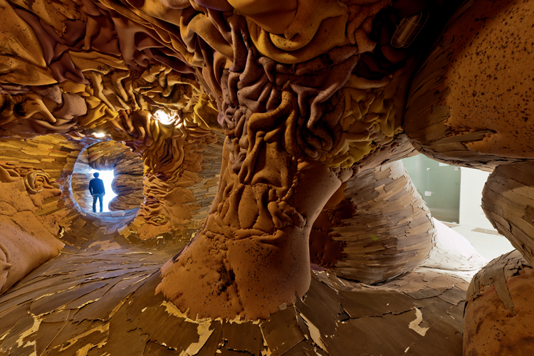

## Henriques Oliviera: installation work

RELATED TERMS: 

Ursulinens Prolapse Photograph Otto Saxinger

Henriques Oliviera creates forms, using old plywood, fencing and PVC as his medium, which look organic and sometimes can be entered, as in the example above.

Olivier's website can be found here: [http://www.henriqueoliveira.com/portu/comercio_i.asp?flg_Lingua=1&cod_Artista=1&cod_Serie=31](http://www.henriqueoliveira.com/portu/comercio_i.asp?flg_Lingua=1&cod_Artista=1&cod_Serie=31)

More examples of his work can be found here: 

[http://www.inspirationgreen.com/henrique-oliveira.html](http://www.inspirationgreen.com/henrique-oliveira.html)

