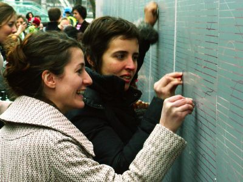
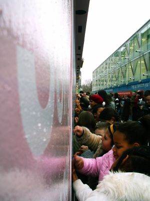

## Hidden Love Songs

RELATED TERMS: 

Hidden Love Songs was created by Arlete Costelo and Melissa Mongiat, while students on the MA Narrative environments course, Central Saint Martins. The 20-metre installation helped to brighten the area around the Royal Festival Hall during building works. The hidden love messages were gradually revealed in the lead up to St Valentine’s Day [Date]

Commuters on a busy walkway alongside the Royal Festival Hall will be able to read love messages whilst they are serenaded by Mark-Anthony Turnage’s latest composition.

 
The creators of the installation, Melissa Mongiat and Arlete Costelo, scratching off the first love messages

The new installation is the latest in a series to brighten a popular commuter route alongside the Royal Festival Hall linking the Golden Jubilee Bridges and Belvedere Road.

 
Children from Ashmole Primary School in Lambeth help to unveil the installation

The installation contains hundreds of love messages written by Londoners, hidden behind a silver film – the same material and technique as scratch cards. Visitors to the South Bank walking past the installation will be encouraged to scratch away the silver to reveal the poems and messages, while being serenaded by excerpts from Mark-Anthony Turnage’s composition _Hidden Love Song_.

The installation is a collaboration between the South Bank Centre, the London Philharmonic Orchestra, Central Saint Martins and two primary schools in Lambeth and Kent.

Poems and messages, some anonymous, tell the true stories of unrequited love and chance encounters. Mark-Anthony Turnage has contributed his own message; his composition was written in secret for his fiancée and inspired by WH Auden’s poem _Lay your sleeping head my love_.

“We hope to bring some romance to London’s commuters with this installation, which cleverly brings together three different art forms and organisations,” said Jude Kelly, artistic director of the South Bank Centre.

