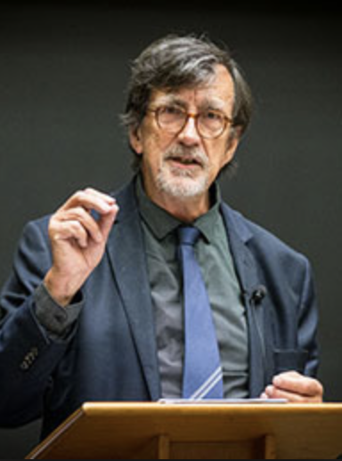

## Latour

**RELATED TERMS: Actor-Network Theory**

Bruno Latour at Recomposing the humanities event, New Literary History

Bruno Latour summarises concisely the necessity of considering at one and the same time the three interconnected dimensions or actantial fields of narrative environment design, that is, narrative (discourse), people (society) and environment (real), in the following sentence:

“Is it our fault if the networks [of both the modern and the ‘non-modern’ or ‘pre-modern’ world] are simultaneously real, like nature, narrated, like discourse, and collective, like society?” (Latour, 1993: 6)

Latour, B. (1993). _We have never been modern_. Cambridge, MA: Harvard University Press.

