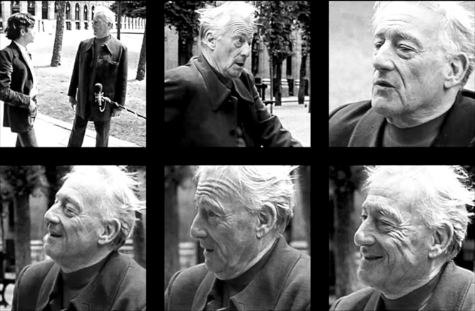

## Lefebvre

**RELATED TERMS: **

Henri Lefebvre is one of the core writers, along with Michel de Certeau, for examining, understanding and deploying social, spatial and environmental practices in a narrative environment. Lefebvre distinguished between three spatial spheres: the ‘perceived space’ of everyday social life; the ‘conceived space’ of planners and speculators; and the sphere of ‘lived space’, as part of lived experience.

Poster (2002) notes that Lefebvre borrowed the notion of “lived experience”, i.e. le vecu or erlebnis, from phenomenology and existentialism. The category of lived experience functioned as a critique of rationalist metaphysics deriving from Cartesian, Kantian, and Hegelian traditions, and can be found in Edmund Husserl’s _Phenomenology and the Crisis of the European Sciences_, in Martin Heidegger’s early existentialism of _Being and Time_, and in French translations and adaptations of these works such as Jean-Paul Sartre’s _Being and Nothingness_ and Maurice Merleau-Ponty’s _Phenomenology of Perception._ Elden (2004) further notes that Lefebvre’s reading of space is heavily indebted to Heidegger, although his understanding of production, in _The Production of Space_, is a development of Marx’s thinking.

Lefebvre associates his last term, lived space or lived experience, with a symbolic re-imagining of urban space that reconfigures the banality of the first term, perceived space. Art and literature, he believes, have helped keep such alternatives alive. Everyday life under capitalism, which is the focus of Lefebvre’s critical thinking, particularly modern life in the post-1945 period, can therefore be redeemed and given new social meanings through the creative re-appropriation of its given products and structures (Brooker, 2003: 97).

Lefebvre argues that insofar as a ‘science’ of the human is possible, its material resides in the ‘trivial’ and the ‘everyday’. This argument can perhaps be derived, ultimately, from the writings of Walter Benjamin and his attempt to redeem the detritus of modern experience from anonymity (Evans, 1997: 223).

Lefebvre writes in _Critique of Everyday Life_ in 1947 that, “the critique of everyday life involves a critique of political life, in that everyday life already contains and constitutes such a critique: in that it is that critique.” The issue at stake in the concept of daily life, therefore, was, and is, the recognition of the failure of Big Politics to offer anything like an adequate domain for human life (Poster, 2002: 743).

**References**

Brooker, P. (2003). _A Glossary of Cultural Theory_, 2nd ed. London, UK: Arnold.

Evans, D. (1997). Michel Maffesoli’s sociology of modernity and postmodernity: an introduction and critical assessment. _Sociological Review_, 45 (2), 220–243\. Available from http://doi.wiley.com/10.1111/1467-954X.00062 [Accessed 7 May 2016].

Lefebvre, H. (1976). _The Survival of capitalism: reproduction of the relations of production_. New York, NY: St Martins Press.

Lefebvre, H. (1987). The Everyday and everydayness. _Yale French Studies_, 73, 7–11\. Available from http://links.jstor.org/sici?sici=0044-0078%281987%290%3A73%3C7%3ATEAE%3E2.0.CO%3B2-U [Accessed 7 April 2014].

Lefebvre, H. (1991). _The production of space_. Oxford, UK: Blackwell.

Lefebvre, H. (1996). _Writings on cities,_ edited by E. Kofman and E. Lebas. Oxford, UK: Blackwell.

Lefebvre, H. (2004). _Rhythmanalysis: space, time and everyday life_. London, UK: Continuum.

Lefebvre, H. (2009). _State, space, world: selected essays,_ edited by _N._ Brenner and S. Elden. Minneapolis, MN: University of Minnesota Press.

Lefebvre, H. (2014). _Critique of everyday life. The one-volume edition_. London, UK: Verso.

Poster, M. (2002). Everyday (virtual) life. _New Literary History_, 33 (4), 743–760\. Available from http://www.jstor.org/stable/20057754 [Accessed 7 May 2016].

