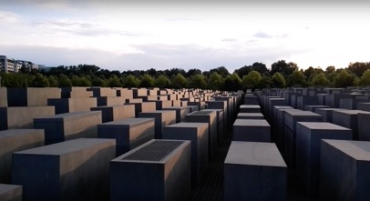

## Memorial to the Murdered Jews of Europe (Denkmal für die ermordeten Juden Europas)

RELATED TERMS: 

**Denkmal für die ermordeten Juden Europas – Memorial to the Murdered Jews of Europe, proposed by Benjamin Mackay, November 2017**

Image Credit: https://www.youtube.com/watch?v=JTwcpeb7C1E

Richard Brody (2012), writing in The New Yorker considered that,

“Without that title, it would be impossible to know what the structure is meant to commemorate; there’s nothing about these concrete slabs that signifies any of the words of the title, except, perhaps, “memorial” – insofar as some of them, depending on their height, may resemble either headstones or sarcophagi.”

Designed by architect Peter Eisenman and built by engineers Buro Happold, the memorial to the Murdered Jews of Europe performs in multiple ways.

Whether or not the narrative of ‘memorial’ is apparent, the site acts an example of Berlin’s 20th-century history.

An urban, international city whose built and social landscape was changed irrevocably by an aggressive war, the memorial could be read as an abstract landscape after artillery fire. The passages between the plinths acting as the veins of the city below a raised surface.

With a literal narrative publicly available below ground, above ground visitors to the site are free to find their own narratives. Adventure park, meditative park or therapy space. These and other activities have all been witnessed. Strangely, given the purpose and name of the site, it might be suggested that it is actually a place to engage with one’s curiosity and perhaps even freedom.

**Reference**

Brody, Richard. “The Inadequacy of Berlin’s “Memorial to the Murdered Jews of Europe””. _The New Yorker_, 7 December 2012\. Available at [https://www.newyorker.com/culture/richard-brody/the-inadequacy-of-berlins-memorial-to-the-murdered-jews-of-europe](https://www.newyorker.com/culture/richard-brody/the-inadequacy-of-berlins-memorial-to-the-murdered-jews-of-europe) [Accessed: 8 October 2017].

