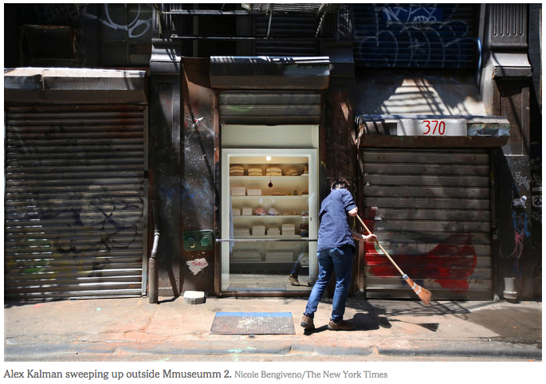

## Mmuseumm 2: Sara Berman’s Closet

RELATED TERMS: 

Mmuseumm 2 is a storefront-window exhibition space in TriBeCa, New York City. In the tiny museum, the artist Maira Kalman has painstakingly re-created the closet of her mother, Sara Berman. The accessories that were once neatly arranged in Berman’s West Village apartment, along with such mementos as her perfume and her box grater, are now displayed behind a pane of glass, like a diorama of urban life. The 5-foot-by-4-foot Mmuseumm 2 is smaller than Sara Berman’s actual closet.

The idea for the museum is to use such assortments of the everyday and the offbeat to reflect on a larger story, looking at humanity through artefacts.

In terms of being a narrative environment, Mmuseumm 2 effects a multiple translation or transformation, a re-telling or re-articulation, of the everyday: it takes the everyday of the domestic bedroom and places it in the everyday of the street, mixing private and public; at the same time, it takes the concept of the museum, as an institutional interior which you have to enter, displaying valuable or extra-ordinary objects, and transforms it into an exterior displaying ordinary objects which can be accessed by the passer-by.

Mmuseumm was founded by Alex Kalman, Maira Kalman’s son, and the filmmakers Josh and Benny Safdie. The exhibitions at Mmuseumm are accompanied by a phone-in informational audio guides.

