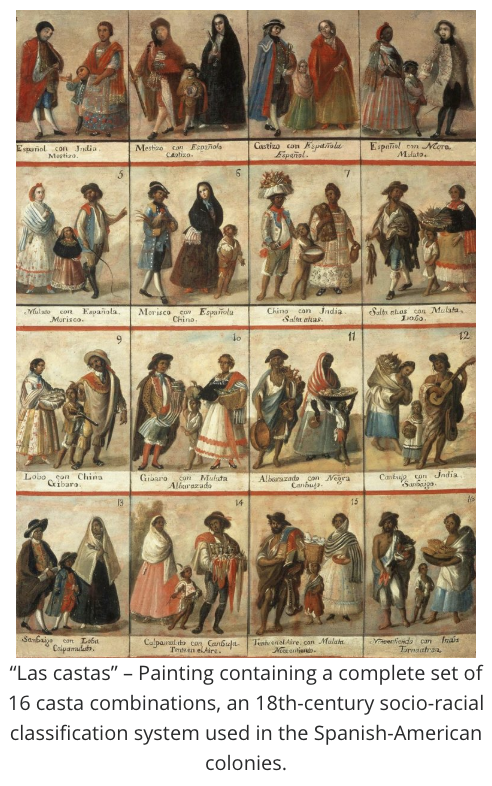

## Modernity and Coloniality

**RELATED TERMS: Cultural Sudies**

  
It has been argued, for example by Peruvian sociologist Anibal Quijani and Argentinian semiotician Walter Mignolo, that modernity and coloniality are inseparable, two sides of the same coin. ‘Coloniality’, Mignolo states, is short hand for colonial matrix or colonial order of power. In this view, modernity is an epistemological frame that is inseparably bound to the European colonial project. Thus, decolonialists seek to move beyond the overly geographical determinism of various critiques of Eurocentrism, while developing an epistemic conception of coloniality. In this way, it is seen that epistemic hegemony is not limited to particular places. Decolonial thinkers suggest that there is a history of epistemic violence in every geographical location, including the West. 

For Stephen Toulmin, in _Cosmopolis, The Hidden Agenda of Modernity_ (1990), the hidden agenda of modernity was the humanistic lineage running alongside instrumental reason; for Walter Mignolo, the hidden agenda, and darker side, of modernity was coloniality. Thus, Mignolo argues, ‘modernity’ is a European narrative that occludes its darker side, ‘coloniality’. Furthermore, Mignolo continues, if there cannot be modernity without coloniality, there cannot be either global modernities without global colonialities. 

As Michael Baker (2012) explains, coloniality emerges, in part, from colonialism, but is distinct from it. Thus, “Coloniality articulates the logical structure of power/knowledge relations that emerged with the formation and expansion of Europe as a civilized/civilizational complex from the fifteenth century to the present (Alcoff, 2007). This worldwide political structure of power/knowledge relations controls the permissible forms of economic exchange, sexuality, gender, subjectivity, knowledge and education.”

**Coloniality, De-coloniality, Post-modernity, Post-Structuralism and Post-colonialism** 

In Mignolo and Walsh’s (2018) view, decolonisation during the Cold War meant the struggle for liberation of Third World countries and, when successful, the formation of nation-states claiming sovereignty. By the 1990s, however, the failure of decolonisation in most nations had become clear. With states in the hands of minority elites, the patterns of colonial power continued both through internal colonialism and in relation to global structures. At that moment coloniality was unveiled, and simultaneously decoloniality was born. 

The conjoint conception coloniality/decoloniality, introduced by Aníbal Quijano in 1990, was the moment at which the Cold War closed and neoliberal global designs opened. Mignolo (2007) insists that coloniality and de-coloniality imake a break with: 
* the Eurocentric project of post-modernity; and 
* a project of post-colonialism heavily dependent on post-structuralism. 

The break with the post-colonial canon, which includes, for example, Edward Said, Gayatri Spivak and Homi Bhabha, is due to its reliance upon such European writers as Michel Foucault, Jacques Lacan and Jacques Derrida. The de-colonial shift is conceived as a project of de-linking; while post-colonialist criticism and theory is a project of scholarly transformation within the academy, Mignolo argues. Decoloniality, Mignolo states, starts from other sources. They include:

* the de-colonial shift already implicit in works by Waman Puma de Ayala; 
* the de-colonial critique and activism of Mahatma Gandhi; 
* the fracture of Marxism in its encounter with colonial legacies in the Andes, articulated by Jose Carlos Mariategui; and 
* the radical political and epistemological shifts enacted by Amilcar Cabral, Aime Cesaire, Frantz Fanon, Rigoberta Menchu, Gloria Anzaldua, among others. 
 
**De-Linking**  

Mignolo (2007) argues that Samir Amin’s early version of de-linking, in which he proposed a ‘polycentric world’ as the path after de-linking, was conceived as an economic and political de-linking from the Imperial States, such as Western European capitalists countries and the USA. Such economic and political de-linking should now be accompanied by an epistemic de-linking from the rhetoric of modernity and the logic of coloniality, a delinking that leads to de-colonial epistemic shift and brings to the foreground other epistemologies, other principles of knowledge and understanding and, consequently, other economies, other politics, other ethics.

New inter-cultural communication should therefore be interpreted as new inter-epistemic communication, such as, for example, in the case of the concept of inter-culturality among indigenous intellectuals in Ecuador. Furthermore, such de-linking presupposes a move toward a geo-politics and a body politics of knowledge that, on the one hand, denounces the claimed universality of a particular ethnicity (body politics), located in a specific part of the planet (geo-politics), i.e. Europe, where capitalism accumulated as a consequence of colonialism. De-linking, then, can be understood as a de-colonial epistemic shift leading to pluri-versality, rather than to the hegemony of Eurocentric ethnic understanding, with its socio-historical specificity, posing as universal knowledge. 

**References** 

Baker, M. (2012). Modernity/coloniality and Eurocentric education: towards a post-Occidental self-understanding of the present. _Policy Futures in Education_, 10 (1), 4–22\. Available from http://journals.sagepub.com/doi/10.2304/pfie.2012.10.1.4 [Accessed 1 June 2019]. 

Mayblin, L. (No date). Modernity / Coloniality. _Global Social Theory_. Available from [https://globalsocialtheory.org/concepts/colonialitymodernity/](https://globalsocialtheory.org/concepts/colonialitymodernity/) [Accessed 1 June 2019] 

Mignolo, W.D. (2007). Delinking. _Cultural Studies_, 21 (2–3), 449–514\. Available from https://www.tandfonline.com/doi/full/10.1080/09502380601162647 [Accessed 2 June 2019]. 

Mignolo, W.D. and Walsh, C.E. (2018). _On decoloniality: concepts, analytics, praxis_. Durham, NC: Duke University Press. 

Quijano, A. (2007). Coloniality and modernity/rationality. _Cultural Studies_, 21 (2–3), 168–178\. Available from https://www.tandfonline.com/doi/full/10.1080/09502380601164353 [Accessed 2 June 2019].

