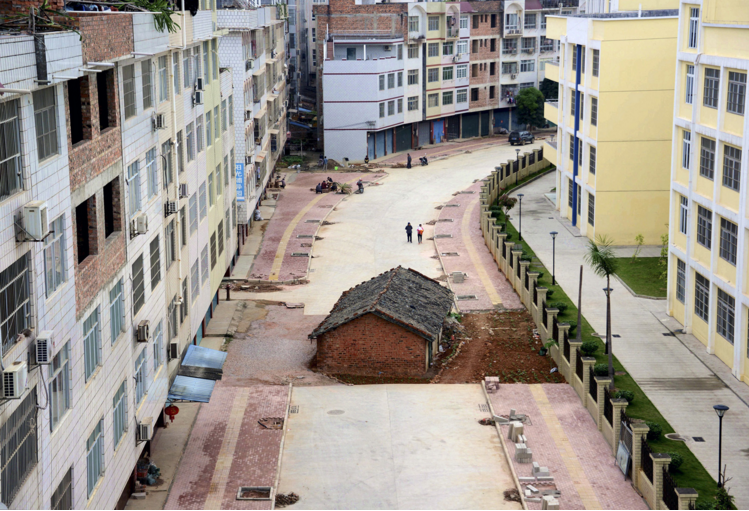
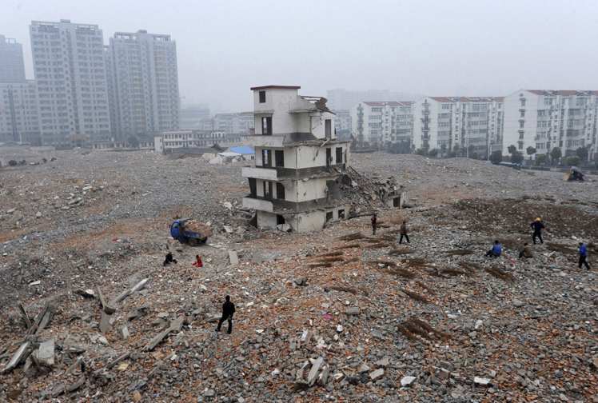
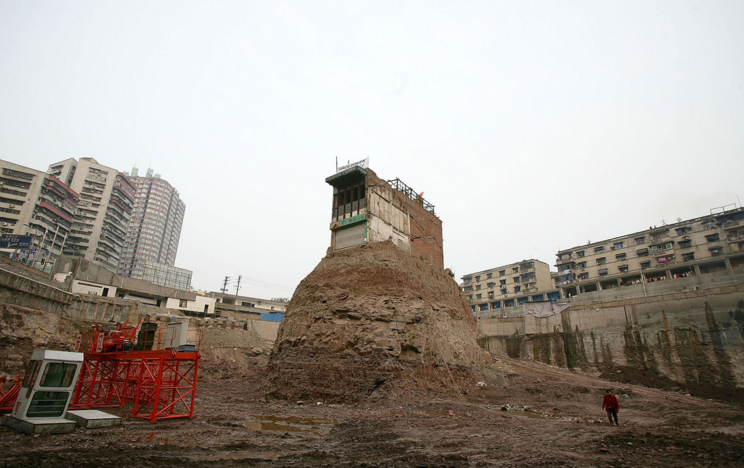
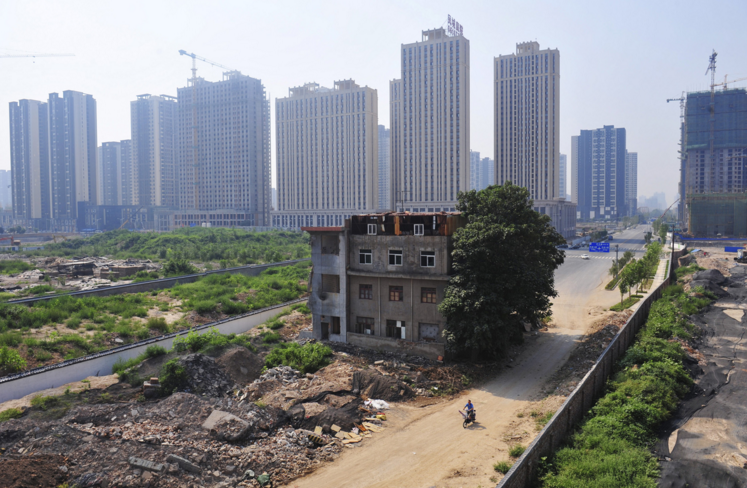

## Nail houses

RELATED TERMS: 

In China, nail houses are older properties that stand alone amid new property development projects. They belong to owners who have stood their ground and resisted demolition. A few homeowners have won their fights against the developers, but most have lost. Such nail houses have become powerful symbols of resistance to the headlong rush of world’s fastest-growing major economy.

The dramatic conflict represented here concerns the tension between progress or modernisation and slower and more traditional forms; it is a conflict over how environments are valued: for their human qualities; or for their financial value. The conflict may also be between the conceived space of the developer and the perceived space of the inhabitant.

