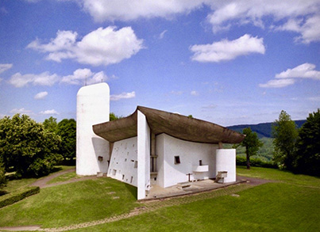
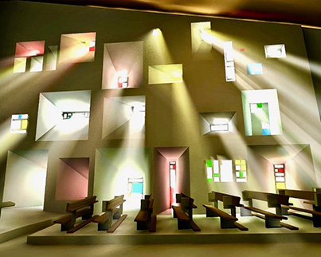

## Notre Dame du Haut - Ronchamp Cathedral

RELATED TERMS: 

**Notre Dame du Haut (Ronchamp Cathedral): a narrative environment, suggested by Rhiannon Williams, November 2017**

Completed in 1954, Chapelle Notre Dame du Haut is a small chapel in Ronchamp, France. Designed by the architect Le Corbusier, it was built on a pre-existing pilgrimage site.

Arguably, all religious buildings are narrative environments. Their architectural elements guide our behaviour and reiterate the stories of religious texts the moment we step inside the building.

Christian churches, for example, make their inhabitants feel humble, with their high ceilings and spires, while channelling them towards the focal point of the pulpit where the scriptural narratives are delivered. The floor plan of many Christian churches is cruciform, reinforcing the story of the cross.

Le Corbusier provides an additional layer of narrativity by subverting religious architectural norms. By purposefully using elements such as vast, curving lines, tiny, strategically placed, jewel-like windows, a huge concrete wall and a ‘floating’ roof admitting light, Le Corbusier re-writes the church as narrative environment. He uses the building to rethink sacredness and show how it can be established in a variety of ways.

