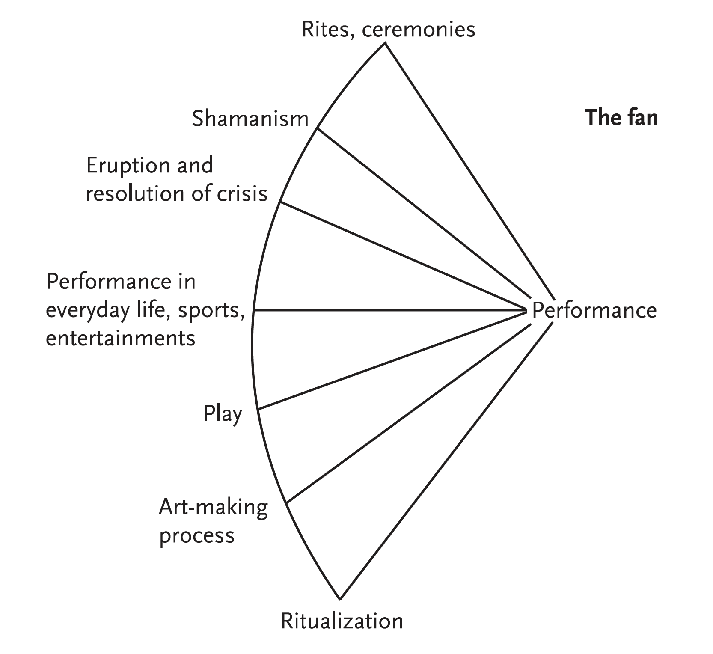
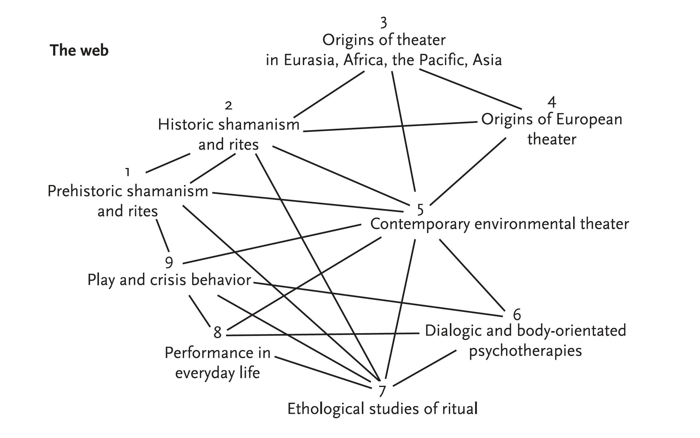

## Performance

**RELATED TERMS: [Actantiality](https://narrative-environments.github.io/CourseCompendium/Actantiality.html); Happenings; Performance Art; Performative and Performativity; Metalepsis**

The terms performance and performative are important for the design of narrative environments because, it is argued, they are performed by a participant. This performance takes on a different character depending on the narrative environment itself and may involve a combination of consumption by a consumer; reception by a reader, spectator or audience; or instrumental use by a user, as well as scripted or unscripted (improvisational) actions and decisions by the participant. 

The performativity of the narrative environment may also be discussed in terms of actantiality or actantiality-passantiality. In any case, through performance, the 'as if' is brought together with the 'is', to explore actual or potential transformations from one state of being to another. Systems of performative transformations, whatever their material aspects, Schechner (2004, xviii) notes, "also include incomplete, unbalanced transformations of time and space: doing a specific “there and then” in this particular “here and now” in such a way that all four dimensions are kept in play."

Richard Schechner conceives of the topics which relate to the term performance as a fan or as a web, as follows:

Source: Richard Schechner, _Performance Theory_

Source: Richard Schechner, _Performance Theory_

**References**

Parker, A. and Sedgwick, E. K. (eds) (1995) _Performativity and performance_. New York, NY: Routledge.

Schechner, R. (2004) _Performance theory_. Rev & exp.ed. New York, NY: Routledge.
