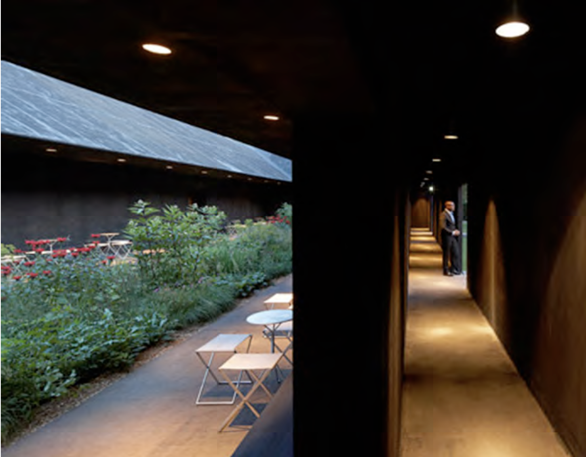

## Peter Zumthor – Serpentine Pavilion

RELATED TERMS: 

Contributed by Dan Mifsud 

Claude St Arroman describes Zumthor's pavilion in the following terms:

Peter Zumthor’s Serpentine pavilion illustrates the principles of interiority and exteriory through the expression of the boundary as a corridor and point of porosity between inside and outside spaces which are both, in this case, dedicated to nature. 

The ‘outside’ is Kensington Gardens, relatively manicured to provide the visual and spatial ideals of Victorian public space in England. The ‘inside’ is an open air garden of wildflowers irrigated directly by the fall of a roof which also acts as a pergola and shelter, where visitors can sit and converse in relative intimacy while contemplating flowers and vegetation at the core of the cloister.

Extract from Movement and Flow at the Boundary. Claude St Arroman, 2011. Metadesigners Open Network [https://metadesigners.org/Downloadable-Articles](https://metadesigners.org/Downloadable-Articles)

