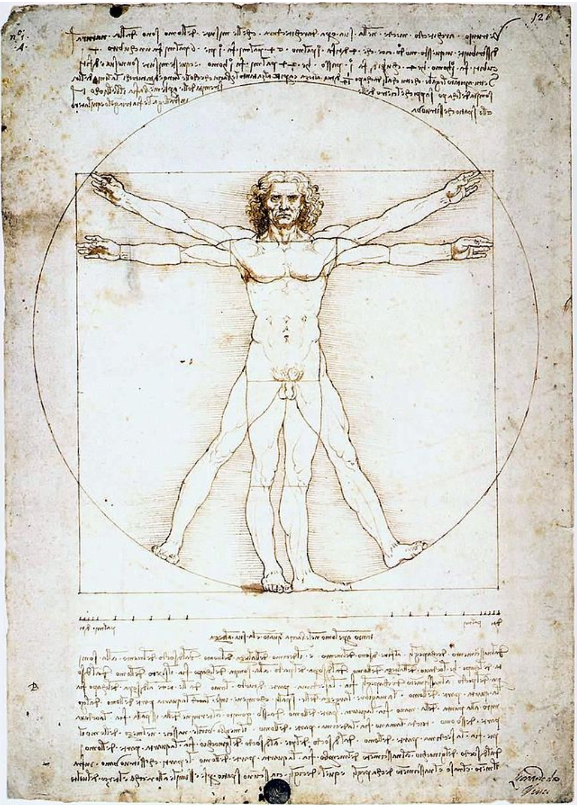

# Posthumanities

**RELATED TERMS: Posthumanism; Postanthropocentrism; Posthuman;**

According to Rosi Braidotti (2019), critical posthumanities is an emergent field of enquiry based on the convergence of posthumanism and postanthropocentrism. Posthumanism develops a critique of the humanist ideal of ‘Man’: Vitruvian 'Man' as the allegedly universal measure of all things. Postanthropocentrism criticizes species hierarchy and human exceptionalism.

Post-Humanism names a critical awareness of the limitations of humanist 'Man'. As Rosi Braidotti notes,

"Some of us are not even considered fully human now, let alone at previous moments of Western social, political and scientific history. Not if by ‘human’ we mean that creature familiar to us from the Enlightenment and its legacy: ‘The Cartesian subject of the cogito, the Kantian “community of reasonable beings”, or, in more sociological terms, the subject as citizen, rights-holder, property-owner, and so on’ (Wolfe, 2010a)."

**References**

Braidotti, R. (2013) _The Posthuman_. Cambridge, UK: Polity. 

Braidotti, R. (2019) ‘A Theoretical framework for the critical posthumanities’, _Theory, Culture and Society_, 36(6), pp. 31–61. doi: 10.1177/0263276418771486.
