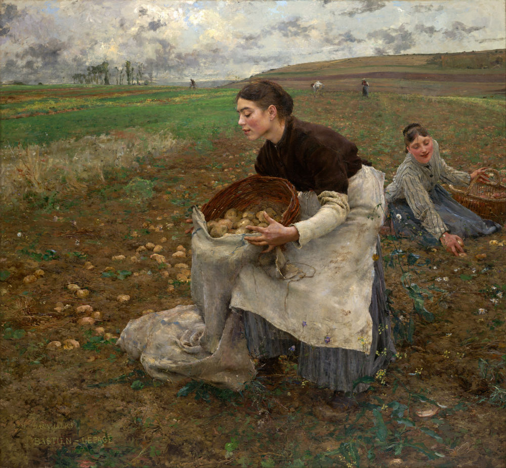

## Realism

RELATED TERMS: 

Jules Bastien-Lepage, October, 1878, National Gallery of Victoria

**Rationale**

What does it mean to ask whether a particular narrative environment is ‘realistic’? How meaningful is the question of ‘realism’ for narrative environment design? Is it an important question, or one that is more important for works of art, whether literary, visual or audiovisual?

It is suggested that, while not directly relevant as an aesthetic, semiotic or representational judgment, the question of ‘realism’ is important for the narrative environment designer because it also implicitly raises the questions of ’reality’, that which is being represented, and, by implication, the question of the ‘subject’ (actant or interpretant), for whom the ‘work’ establishes a relationship between that which is ‘realistic’ and that which is ‘real’ and, furthermore, that which is ‘fictional’ and that which is ‘factual’. It is further suggested that understanding the complex relationships among these four terms, ‘realistic’, ‘reality’, ‘fictional’ and ‘factual’, is vital for understanding how the ‘real’ is constituted and experienced.

One important reason for considering ‘realism’ for narrative environment design, then, especially in its ‘deformed’ or ‘neo-‘ forms, is the nature of the (human) ’subject’, (or, more broadly, in a post-humanist and ‘augmented reality’ digital environment, the ‘persona’, 'avatar' or ’actant’) that is implied, especially in terms of how its bodily capacities are implicated in relationship to the ‘work’, which determines the nature of the participatory action required of the (human or other) ’subject’ (interpretant, actant). In terms of participation, then, the implied ’subject’ of a conventional work of ‘realism’ is of the nature of a reader, viewer, spectator or auditor, that is, focused primarily on ‘the eye’ with responses that are primarily intellectual. The sensory range is curtailed, excluding the other sense-organs, and the interpretive range is restricted, to cognitive understanding, issues which Juhani Pallasmaaa (2005, 2009) discusses in the context of architectural design.

In short, ‘realism’ is not a primary issue for the designer of narrative environments. However, the issue of ‘reality’ is a key concern for the designer. So is the relationship established to an implied/addressed ‘subject’, through whatever degree of participation is called upon, between the narrative environment and the ‘reality’ that the designer is seeking to evoke, affirm or critique; or, indeed, critically affirm. It should be noted that this assumes that the primary aim of a narrative environment design is not simply to describe, show or represent a reality, but to take up an active, practical, critical relationship to a specific definable (social or social-material) ’reality’. While those artefacts deemed to be works of ‘realism’, for example, in the late 19th century may have been ‘critical’ of the ‘reality’ they were representing, the implied subject received that critique as a reader of a literary text or as a viewer of a pictorial text, in short, as a spectator of that ‘reality’ not as an active participant in that ‘reality’. For the participant (actant) in a narrative environment, while it may the world of an other that is being enacted (their world), it is presented in such a way that ‘you’, the participant (actant) is implicated, so that ‘your world’ is put into relation with ‘their world’ in a practical dialogue.

It is, therefore, not so much the techniques of ‘realism’ that are of primary interest or value to the narrative environment designer, but their purpose: to highlight in a critical manner, to establish a critical relationship to, a represented, enacted ‘reality’. It has to be said, in case there are any misunderstandings at this point, that ‘reality’ itself is always in question, realised as emergence through a plurality (Arendt, 1990) of distinct standpoints and viewpoints inter-acting while seeking to establish the (symbolic, rational) ‘reality principles’ (Brown, 2015, 2018; Parsons, 2018) among themselves.

Because narrative environments are ‘designs’ more than they are ‘works of art’, they are not simply works of representation, realistic or otherwise. They take place in ‘the real’, and (re-)enact the real, nevertheless their ‘reality’ is a ‘mixed reality’ (both realistic and real, both fictional and factual) and they are often perceived in terms and frames that have been characterised in various past ‘realistic’ modes of art and other media forms such as journalism and news broadcasting. It is therefore valuable to consider the meanings that attach to the term ‘realism’ and its relationship to ‘reality’.

**Realism in Jakobson: Summary**

Although one should bear in mind, as Nelson Goodman cautions, that, “Realism, like reality, is multiple and evanescent, and no one account of it will do.” (Goodman, 1983: 272) **[1]**, nevertheless, in discussing ‘realism’, a good place to start is the work of Roman Jakobson (1987), who differentiates among five different meanings of the word ‘realism’:

A. Realism as the intention of the author/creator/maker, who conceives the text as realistic;

B. Realism as the reception of the text, i.e. the reader/spectator/auditor perceives the text as realistic;

C. Realism as literature and painting characteristic of the realistic movement(s) of the nineteenth century, literary realism and realism in painting **[2]**;

D. Realism as any number of literary, painterly, theatrical, photographic or cinematographic techniques and devices which lend a sense of the real to a text, image, cinematic, televisual, videographic or theatrical production;

E. Realism as the consistent motivation and realisation of poetic devices, for example, in the poetic (‘more accurate’) rendering of a delirious experiential state (experiential realism)

For Jakobson (1987: 13), realism does not represent the extra-literary or extra-artistic world as it really is. Rather, it follows certain rules whose goal is to create a particular illusion or impression of reality.

**Realism in Jakobson: Narration**

Realism, as Roman Jakobson (1987) defines it, is “an artistic trend which aims at conveying reality as closely as possible and strives” for maximum verisimilitude. We call realistic those works which we feel accurately depict life by displaying verisimilitude.”

Jakobson points out that this immediately faces us with a dilemma. Realism may be taken to refer to the aspiration and intent of the author, i.e. it is conceived by its author as a display of verisimilitude (meaning A). It is conceived as intending to be true to life. Alternatively, a work may be called realistic if the person judging it perceives it as being true to life (meaning B).

In the first case, we evaluate on an intrinsic basis, in terms of the (literary or other artistic) conventions used (the diegesic universe, in Souriau’s phrase), the structure and rhetoric of the work. In the second case, the reader’s individual impression is the decisive criterion (the imaginary world constructed by the reader/spectator/auditor ‘measured’ against or compared with/contrasted with the symbolic world the reader/spectator/auditor inhabits), reception and interpretation of the work.

Jakobson considers that these two distinct meanings have been irredeemably confounded in the history art, such that the question of whether a given work is realistic or not is covertly reduced to the question of what attitude the reader/spectator/auditor takes toward it.

This has led, Jakobson argues, to the emergence of a third meaning. He points out that classicists, sentimentalists, the romanticists (to an extent), even

the “realists” of the nineteenth century, the modernists to a large degree, and finally the futurists, expressionists, and their like, have all proclaimed faithfulness to reality, maximum verisimilitude, in other words, realism, as the guiding motto of their artistic programme.

In the 19th century, this motto gave rise to an artistic movement. It was primarily the late copiers of that trend, Jakobson argues, who outlined the history of art (as recognised at the time of Jakobson’s writing in 1921), in particular, the history of literature. Hence one specific case, one separate artistic movement, was identified as the ultimate manifestation of realism in art and was made the standard by which to measure the degree of realism in preceding and succeeding artistic movements.

Thus, a new covert identification has occurred, a third meaning of the word “realism” has crept in (meaning C), one which comprehends the sum total of the features characteristic of one specific artistic current of the nineteenth century. For literary and art historians in the early 20th century the realistic works of the 19th century represent the highest degree of verisimilitude, the maximum faithfulness to life.

As the conventions of a particular moment in art and literary history come to be equated with realism (meaning C), the definition of realism as the artistic intent to render life as it is (meaning A) becomes subject to ambiguity: realism can be taken as the tendency _to deform_ the given artistic norms that are conceived as an approximation of reality (meaning A 1); or as the tendency _to conform_ to the conventions of a given artistic tradition, one conservatively conceived as faithfulness to reality (meaning A 2).

Taking this ambiguity into account, and applying it in the context of meaning B, which presupposes that my subjective evaluation will pronounce a given artistic fact faithful to reality, meaning B 1 emerges when I rebel against a given artistic code and view its deformation as a more accurate rendition of reality; while meaning  B 2 emerges when I am conservative and view the deformation of the artistic code to which I subscribe as a distortion of reality.

The concrete content of A 1, A 2, B 1 and B 2 is extremely relative, Jakobson notes.

Thus, new realist artists (in the sense of A 1) were compelled to call themselves neo-realists, realists in a higher sense of the word, or naturalists, and they drew a line between quasi- or pseudo-realism (meaning C) and what they conceived to be genuine realism, that is, as borne out in their own work.

‘’I am a realist, but only in the higher sense of the word”, Dostoevski claimed, while almost identical declarations have been made in turn by the Symbolists, by Italian and Russian Futurists, by German Expressionists, and so on.” (Jakobson, 1987: 24)

Progressive realism can be characterised in terms of unessential details. One such device, Jakobson argues, is the condensation of the narrative by means of images based on contiguity, that is, avoidance of the normal designative term in favour of metonymy or synecdoche, a condensation which is realised either in spite of the plot or by eliminating the plot entirely. For example, when describing Anna’s suicide, Tolstoj primarily writes about her handbag. Such an unessential detail would have made no sense to Karamzin, although Karamzin’s own tale, in comparison with the 18th-century adventure novel, would likewise seem but a series of unessential details **[3]**. Since such a device is frequently thought to be realistic, i.e. lifelike in the sense that life does not follow a narrow narrative path but is full of irrelevant (from the perspective of story) personas and events, this gives rise to meaning D, stressing that D is often found within C.

This desire to conceal the answer, this deliberate effort to delay recognition, brings out a new feature, the newly improvised epithet (added quality). Thus, a strange term may be foisted on an object or asserted as a particular aspect of it. Negative parallelism explicitly rejects metaphorical substitution for its proper term: “I am not a tree, I am a woman,” says the girl in a poem by the Czech poet Sramek. This literary construction can be justified; from a special narrative feature, it can become a detail of plot development.

From time to time, the consistent motivation and justification of poetic constructions have also been called realism. Thus, the Czech novelist Capek-Chod in his tale, “The Westernmost Slav” somewhat disingenuously calls the first chapter, in which a ”romantic” fantasy is motivated by typhoid delirium, a “realistic” chapter. Jakobson calls such realism meaning E. That is, it is a mode of ‘realism’ in which the requirement of consistent motivation and realisation of poetic devices is met. Meaning E is often confused with C, B and so on.

**Notes**

**[1]** Similarly, Kirstin Sørensen comments that there are three perceptions of literary realism that predominate. All of them have been considered, and sometimes still are considered, to define literary realism, but all of which ultimately do a disservice to the genre and its appreciation. They are realism as a period phenomenon, that is, the realistic literature of the 19th century; realism as maximum accuracy in the representation of reality; and realism as maximum verisimilitude to the real (appearance of the real).

**[2]** In literature, this includes the work of Honoré de Balzac in France, George Eliot in England, and William Dean Howells in America. In painting, this includes the work of French artists Gustave Courbet, such as, for example, ‘The Stonebreakers’ of1850, Honoré Daumier, and Jean François Millet as well as such US artists as William Sidney Mount, Thomas Eakins and (although a little later in the early 20th century) the Ashcan school. According to literary history, realist literature is was produced in Europe and the USA from the1840s to the 1890s, when realism was superseded by naturalism.

**[3]** As Jakobson (1987: 25) explains, “If the hero of an eighteenth-century adventure novel encounters a passer-by, it may be taken for granted that the latter is of importance either to the hero or, at least, to the plot. But it is obligatory in Gogol or Tolstoj or Dostoevskij that the hero first meet an unimportant and (from the point of view of the story) superfluous passer-by, and that their resulting conversation should have no bearing on the story.”

**References**

Arendt, H. (1990). Philosophy and politics. _Social Research_, 57 (1), 73–103.

Brown, W. (2015). Undoing the Demos. Cambridge, MA: MIT Press

Brown, W. and Hamburger, J. (2018). Wendy Brown: ‘Who is not a neoliberal today?’ Tocqueville21 Blog. Available from [https://tocqueville21.com/interviews/wendy-brown-not-neoliberal-today/](https://tocqueville21.com/interviews/wendy-brown-not-neoliberal-today/) [Accessed 21 January 2018].

Jakobson, R. (1987). _Language in literature_, edited by K. Pomorska and  S. Rudy. Cambridge, MA: Bellknap Press.

Pallasmaa, J. (2005). The eyes of the skin: architecture and the senses. Chichester, UK: Wiley.

Pallasmaa, J. (2009). The thinking hand: existential and embodied wisdom in architecture. Chichester, UK: Wiley.

Parsons, A. (2018). Neoliberalism’s “reality principles”. _Poiesis and Prolepsis_ [Blog]. Available from [http://prolepsis-ap.blogspot.com/2018/01/neoliberalisms-reality-principles.html](http://prolepsis-ap.blogspot.com/2018/01/neoliberalisms-reality-principles.html) [Accessed 9 September 2018].

Shiff, R. (1988). Art history and the nineteenth century: realism and resistance. _Art Bulletin_, 70 (1), 25–48\. Available from [http://www.jstor.org/stable/3051152](http://www.jstor.org/stable/3051152) [Accessed 6 September 2018].

What is literary realism [Website]. [http://www.varlaweb.com/whatisliteraryrealism/word.php](http://www.varlaweb.com/whatisliteraryrealism/word.php)

Willemen, P. (1972). On realism in the cinema. _Screen_, 13 (1), 37–44\. Available from [https://academic.oup.com/screen/article-lookup/doi/10.1093/screen/13.1.37](https://academic.oup.com/screen/article-lookup/doi/10.1093/screen/13.1.37) [Accessed 4 July 2018].

