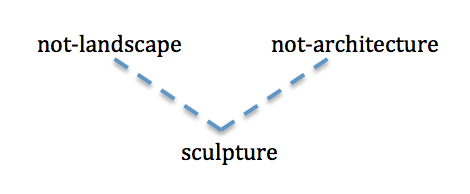
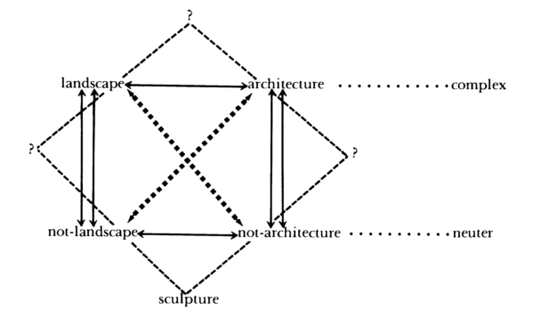
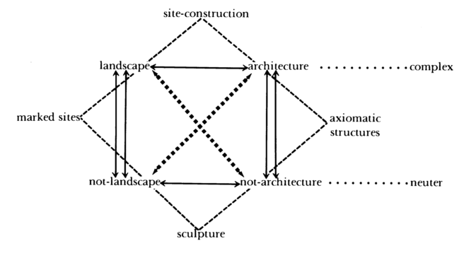

## Sculpture

**RELATED TERMS: Landscape Design; Structuralism; Theoretical practice; Narrative environment design; Architecture**

Narrative environments are not, in any simple sense, architecture nor are they landscape. Nor, furthermore, are they sculpture. Yet narrative environments bear some relation to all of these forms of spatial practice: architectural design, landscape design and sculptural practice. Such fields of practice can be brought into relation to one another in what Rosalind Krauss calls an ‘expanded field’.

Krauss’ (1979) article, “Sculpture in the expanded field”, which is summarised below, highlights the possible utility of structuralist and poststructuralist thinking for the design of narrative environments.

Krauss outlines three eras or periods of sculptural practice: a traditional period in which sculpture adheres to the logic of the monument, a commemorative representation that bears a close relation to the place where it sits; a modernist period in which sculpture loses its relation to place and becomes instead an autonomous, although siteless, homeless or nomadic, artefact; and a post-modernist period in which sculptural practice develops within a field relationships of contrariness, contradictoriness, negation and implication, in short, relationships of difference or of differance (Derrida).

The shift from modernist to post-modernist sculptural practice marks a movement from discrete thinking about the (predefined) properties of an entity or a category to relational thinking about the existing entity and the (emerging) set of possibilities to which it can give rise, i.e. from a practice of making in a craft mode of production (whether for a site or for a series of nomadic destinations) to a practice of selecting, placing and relating, that may involve some making but, more centrally, involves innovating, i.e. making differences.

Rosalind Krauss (1979) points out that a number of surprising works were produced in the late 1960s to the late 1970s under the name of sculpture. Unless this category can be made to become infinitely malleable, Krauss argues, nothing would seem to give this motley collection of works the right to lay claim to be considered sculpture. She contends that although the extension of this term is performed in the name of a vanguard aesthetics, i.e. an ideology of the new, of innovation, its covert message, nonetheless, is that of historicism. The challenge of these diverse productions, their unfamiliarity and uncomfortableness, is rendered comfortable by being made familiar: they are made comprehensible, in an act of recuperation, by being argued to have gradually evolved from the forms of the past.

No sooner had minimal sculpture appeared on the horizon of aesthetic experience in the 1960s than art criticism began to trace a paternity for it, through a set of constructivist fathers who could legitimise and authenticate the strangeness of these phenomena, in the form of the ghosts of Gabo, Tatlin and Lissitzky. This paternity was established despite the content of the one, constructivism, being the contrary of the other, minimalism. For example, Krauss explains, it was not considered important that constructivist forms were intended as visual proof of the mutable logic and coherence of universal geometrics, while their seeming counterparts in minimalism were demonstrably contingent, denoting a universe (or perhaps better polyverse) held together by guy wires, glue or simply the accidents of gravity, and not by Universal Mind.

The process of historicisation swept these distinctions aside as unimportant or negligible.

As the 1960s turned into the 1970s, these processes of historicisation became harder to perform. Under the heading of ‘sculpture’, could now be included piles of thread waste on the floor, sawed redwood timbers rolled into the gallery or stockades of logs surrounded by fire pits. Rather than remaining within the horizon of the 20th century, the critics-historians began to construct genealogies from the data of millennia rather than decades, tracing the paternity of minimalism back to Stonehenge, the Nazca lines and Indian burial mounds. Indeed, anything at all was hauled into the court of criticism-historicism to bear witness to the connection between the work under consideration and its historical precedents, thereby legitimising its status as ‘sculpture’. When the links proved weak, a variety of primitivising work from the earlier part of the 20th century was called upon to mediate between the extreme past and present, a notable example being Constantin Brancusi’s “Endless Column”.

In constructing these paternities and genealogies, the term which was to be given salvation, ‘sculpture’, became obscured. The aim had been to use a universal category to authenticate a group of particulars. However, the category was forced to cover such a heterogeneity that it was in danger of collapsing.

Yet it is widely known that ‘sculpture’ is not a universal category but a historically-bounded one. As a conventional construct, and a conventional field of practice, sculpture has its own internal logic and its own set of rules which are not open to very much change. Krauss argues that the logic of sculpture appears inseparable from the logic of the monument, by virtue of which a sculpture is a commemorative representation that speaks symbolically about the meaning or use of the place wherein it site.

It is because they function in relation to the logic of representation and marking, Krauss continues, that sculptures are usually figurative and vertical, their pedestals mediating between site-place and representation-sign.

However, since this was a convention and is not immutable, this logic began to fail. In the late 19th century, the logic of the monument began to fade, a process that can be witnessed in an examination of two works by August Rodin, “The Gate of Hell” and his statue of “Ba;sac. With these two sculptural projects, Krauss argues, the threshold of the monument is crossed and a space entered which could be called its negative condition; and could be understood as a kind of sitelessness, placelessness or homelessness. Krauss proposes that this marks the modernist period of sculptural production, a mode of production that operates in relation to this loss of site or of ground. The monument is produced as abstraction, the monument as pure marker or base, functionally placeless and self-referential for the most part.

Modernist sculpture, Krauss concludes, is thus nomadic. The sculpture reaches downward to absorb the pedestal into itself an away from actual place. Through the representation of its own materials or the process of construction, the sculpture depicts its own autonomy. Brancusi’s work is taken by Krauss to be exemplary in this respect.

If this is the case, Krauss process, in being the negative condition of the monument, modernist sculpture had a kind of idealist space to explore, cut off from temporal and spatial representation, a domain that could, for a while, be profitably mapped out but which by 1950 began to be exhausted.

In short, it began to be experienced increasingly as pure negativity. Sculpture became something that was possible to locate only in terms of what it was not. By the 1960s, sculpture was what was on or in front of a building that was not the building, or what was in the landscape that was not the landscape, such as exemplified by works by Robert Morris in the early 1960s. Sculpture had ceased to be a positivity and was now the category that resulted from the addition of the not-landscape to the not-architecture:

 

These terms, the not-landscape and the not-architecture, express a strict opposition between the built and the not-built, the artificial and the natural, between which the production of sculpture seemed to be suspended.

These terms can be transformed by a simple inversion into the same polar opposites but this time expressed positively, i.e. the not-architecture is another way of expressing the term landscape, according to the logic of a retain kind of expansion, and the not-landscape is another way of expressing the term architecture. This expansion, Krauss explains, is called a Klein group in mathematics and a Piaget group in the structuralist-inspired human sciences. [This expansion is also, it should be added at this point, called a semiotic square in Greimas’ semantics and narratology, a notation that bears some relationship to the Aristotelian logic square, as diagrammed by Apuleius. Furthermore, such notations are developed by Jacques Lacan in the context of psychoanalysis in the form of the Schema-L.]

By means of this logical expansion, binaries are transformed into a quaternary field:

Krauss analyses the dimensions of this structure as follows:

1) there are two relationships of pure contradiction which are termed axes (and further differentiated into the complex axis and the neuter axis) and are designated by the solid arrows (see diagram); 2) there are two relationships of contradiction, expressed as involution, which are called schemas and are designated by the double arrows; and 3) there are two relationships of implication whicht are called deixes and are designated by the broken arrows.

This expanded field is generated by problematising the oppositions between which the modernist category of sculpture is suspended. Once this expansion has begun, three other categories can be envisioned logically, all of which are a condition of the field itself. Sculpture becomes one term on the periphery of a field:

Historically, it seems that the permission, or perhaps the pressure, to think the expanded field of sculpture was felt in the USA in the years 1968-1970\. By 1970, with the “Partially Buried Woodshed” at Kent State University, Ohio, Robert Smithson had begun to occupy the position that might be termed ‘site construction’, i.e. landscape + architecture. The term ‘marked sites’ could be used to refer to work that was landscape + not-landscape, a position occupied by Robert Smithson’s “Spiral Jetty”, for example, a category that includes both the actual physical manipulations of sites and other forms of marking, such as the application of impermanent marks or the use of photography.

The combination of architect + not-architecture might be termed axiomatic structures, in which there is some kind of intervention into the real space of architecture, for example, through partial reconstruction, drawing, photography or the use of mirrors. The possibility explored in this category is a process of mapping the axiomatic features of the architectural experience, i.e. the abstract conditions of openness and closure, onto the reality of a given space.

During the 1970s, many artists found themselves occupying, in a sequence or succession, different positions within the expanded field. This contradicted the demand of art criticism that was still in the thrall of modernism for the purity and separateness of the various media and thus the specialisation of a practitioner within a given medium.

However, from within the conditions of the post-modern, practice is not defined in relation to a given medium, e.g. sculpture, but rather in relation to the logical operations on a set of cultural terms, for which any specific medium, such as photography, books, lines on walls, mirrors, or, indeed, sculpture itself, might be used.

The expanded field provides for, or affords, an expanded but finite set of related positions for a given artist to occupy and explore and for an organisation of work that is not dictated by the conditions of a particular medium.

The logic of the space of post-modern practice is no longer organised around the definition of a given medium or the grounds of a given material or the perception of the material. It is organised instead through the universe of terms that are felt to be in opposition within a cultural situation, or as it might be expressed, the agonistic field in question.

Thus, within any one of the positions generated by the given logical space, many different media might be employed. Also, any given artist might occupy, successively, any one of the positions.

**References**

Krauss, R.E. (1979). Sculpture in the expanded field. _October_, 8, 30–44\. Available from http://www.jstor.org/stable/778224 [Accessed 10 February 2016].

