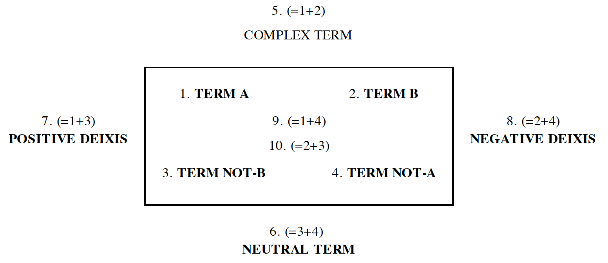
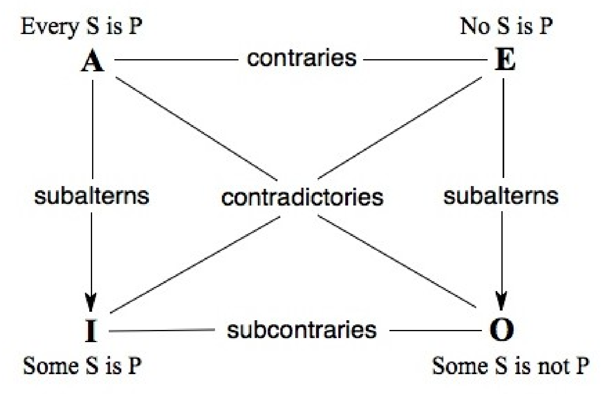

# Semiotic Square - Greimas

**RELATED TERMS: Actantial Model - Greimas; In Medias Res**

The kind of use that is made of Greimas' semiotic square in the design of narrative environments is similar to that of Donna Haraway in 'The Promises of Monsters'. She notes that, in alliance with Bruno Latour, she will use "this clackety, structuralist meaning-making machine" to create a narrative other than "the rational progress of science, in potential league with progressive politics, patiently unveiling a grounding nature. Equally, she will not create a tale that will be a demonstration of the social construction of science and nature that locates all agency firmly on the side of humanity.

Haraway uses the term amodern to refer to "a view of the history of science as culture that insists on the absence of beginnings, enlightenments, and endings: the world has always been in the middle of things, in unruly and practical conversation, full of action and structured by a startling array of actants and of networking and unequal collectives."

She treats as a virtue the much-criticized inability of structuralist devices like the semiotic square to provide diachronic narratives. Instead, Haraway's amodern history will have a geometry, "not of progress, but of permanent and multi-patterned interaction through which lives and worlds get built, human and unhuman."

Thus, she uses the semiotic square to define four spaces as a means to explore how certain local-global struggles for meanings and embodiments of nature are occurring within those spaces. This, a contestable collective world comes into view that takes shape for us out of structures of difference.

Haraway's (mis)interpretation of the structure of semiotic square is as follows:

The semiotic square as set out by Greimas is as follows:

Source, Louis Hebert, 2006, _The Semiotic Square_

The similarity to the traditional diagram for the square of opposition, as presented here by Terence Parsons (2012) is striking: 

**References**

Haraway, D. J. (1992) ‘The Promises of monsters: a regenerative politics for inappropriate/d others’, in Grossberg, L., Nelson, C., and Treicher, P. A. (eds) _Cultural theory_. New York, NY: Routledge, pp. 295–337. 

Hebert, L. (2006) The Semiotic square, _Signo - Applied Semiotics Theories_. Available at: http://www.signosemio.com/greimas/semiotic-square.asp (Accessed: 22 August 2014).

Parsons, T. (2014) ‘The Traditional square of opposition’, _Stanford Encyclopedia of Philosophy_. Spring 2014. Available at: http://plato.stanford.edu/archives/spr2014/entries/square/ (Accessed: 24 December 2014).
