## Sir John Soane Musem

RELATED TERMS: 

Sir John Soane was an architect and typical polymath of his time (he lived from 1753 to 1837). He came from a working class background and rose to the top of his profession. He built the Bank of England (though his work has been largely destroyed by later pomposities) and Dulwich Picture Gallery.

There are several parallel narratives threading through this building (his home), the principal one being a narrative of secrets and discovery, which in fact acts as a framing narrative for the others. Go discover!

Sir John Soane himself probably didn’t think of it in this way, he was probably using his creativity and skill, indulging his fancy and creating an environment to house and display his archeological collection. His delight in the use of light, the creation of enticing and often confusing perspectives and his predilection for secrets and surprises all contribute to the powerful narrativity of the building and collection. The feeling is that the building itself is narrating.

added by Stuart Jones

# Barriers, mysteries, pathways

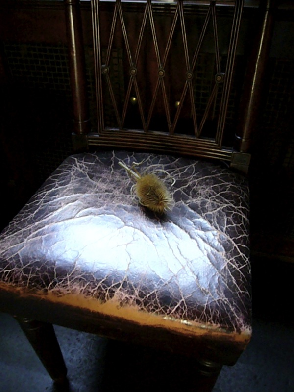

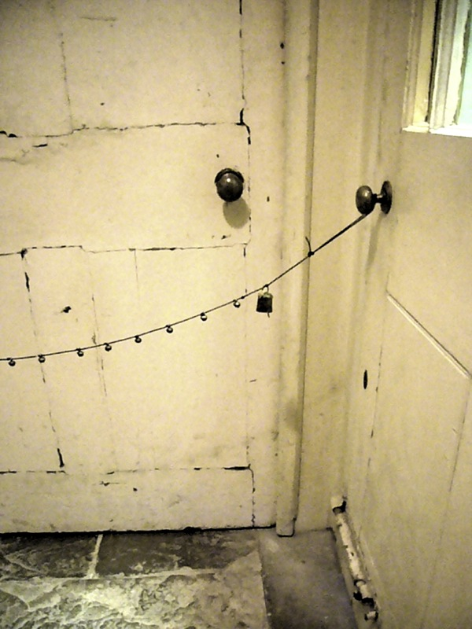

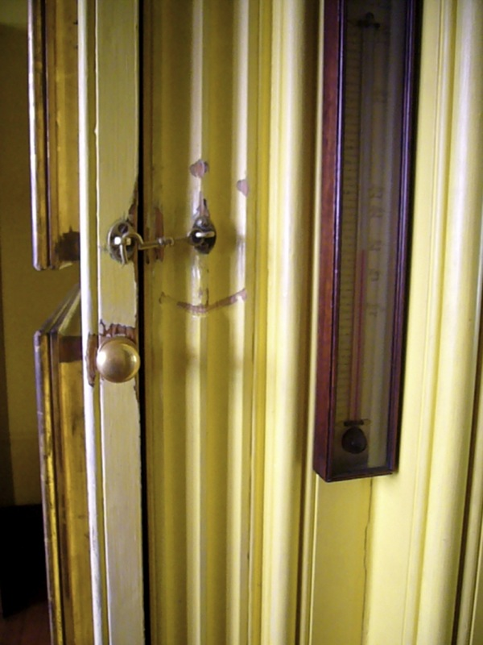

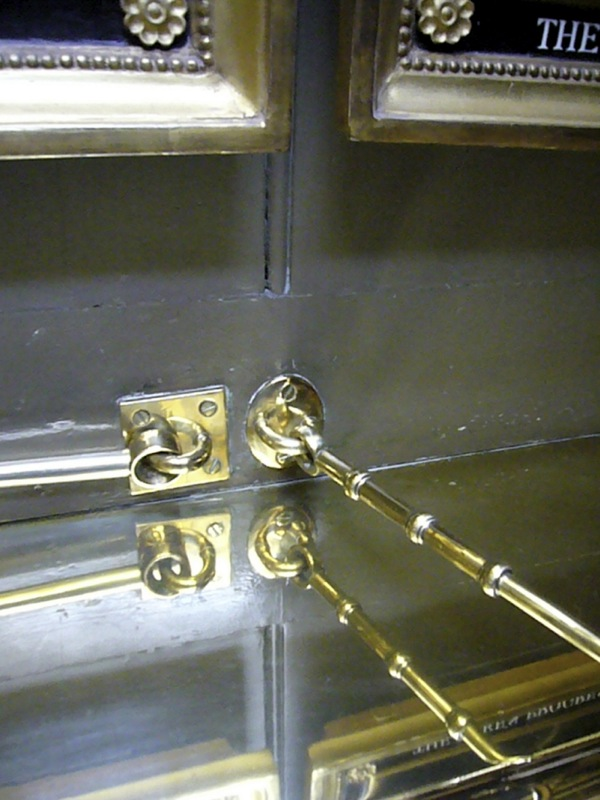

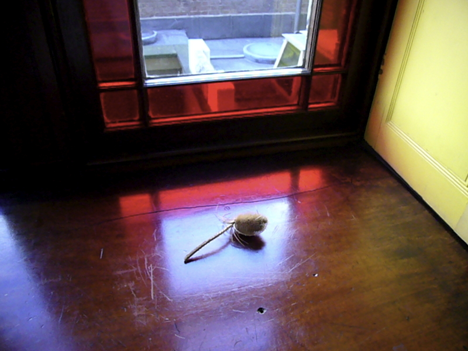

# The Hidden Pictures

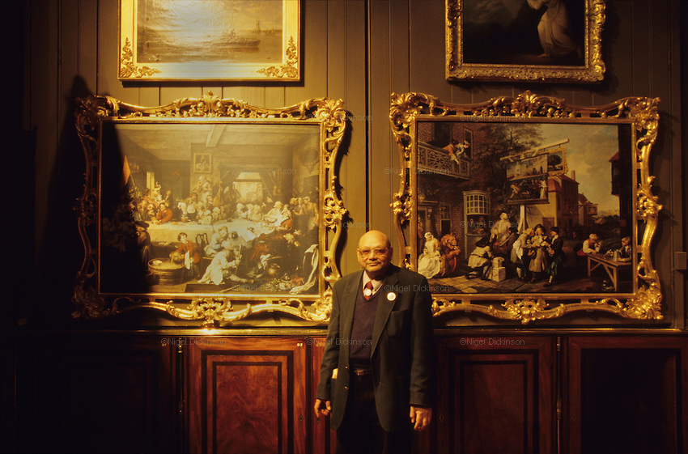

What is this man guarding?

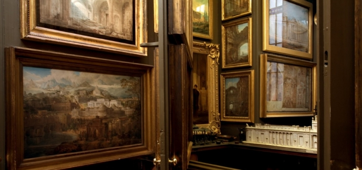

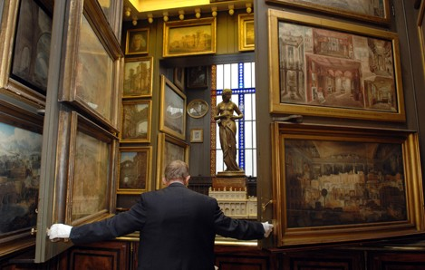

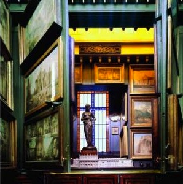

# Views through…

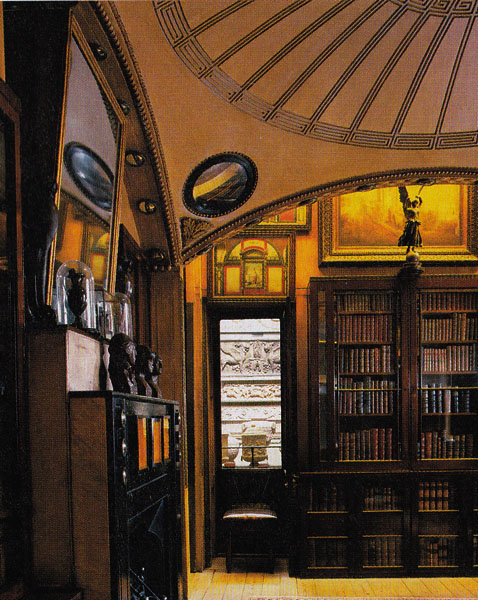

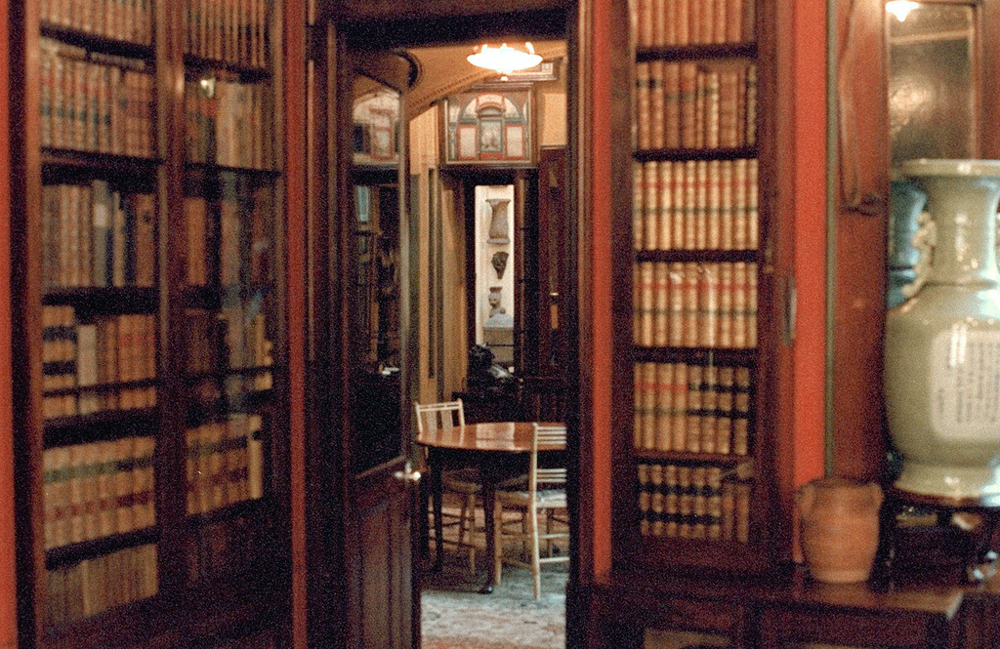

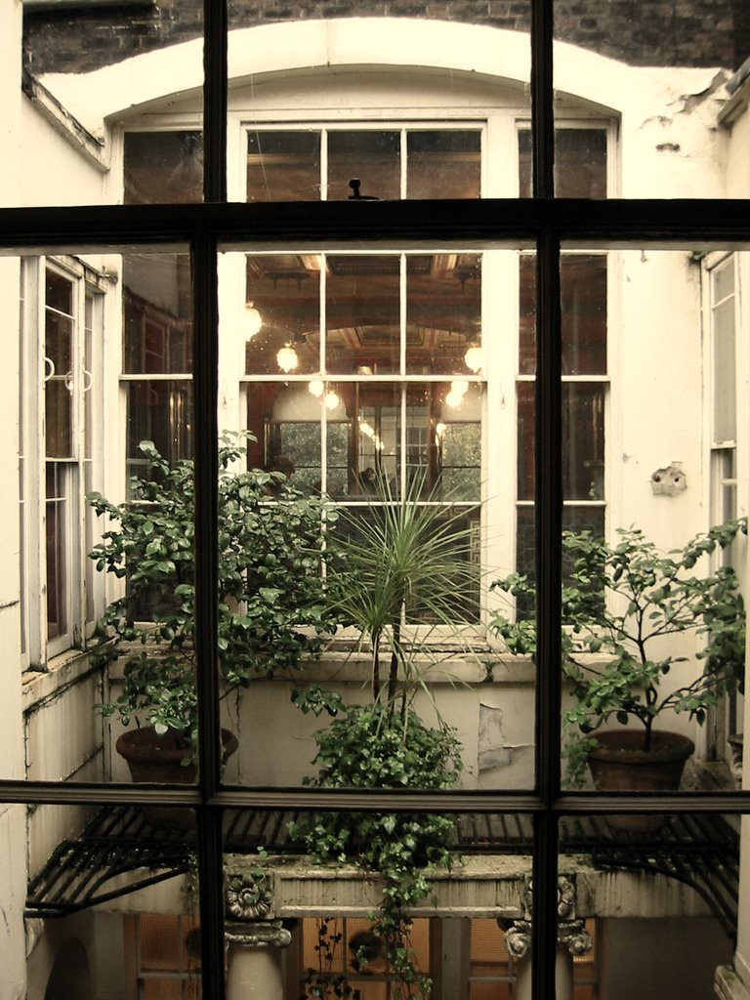

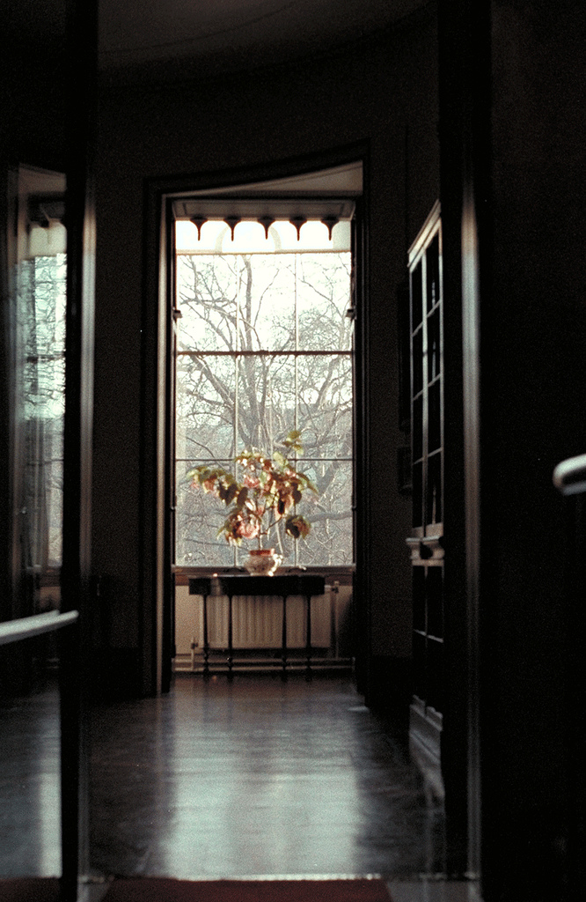

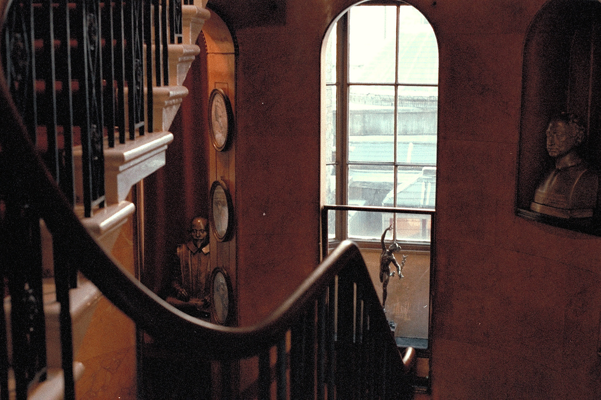

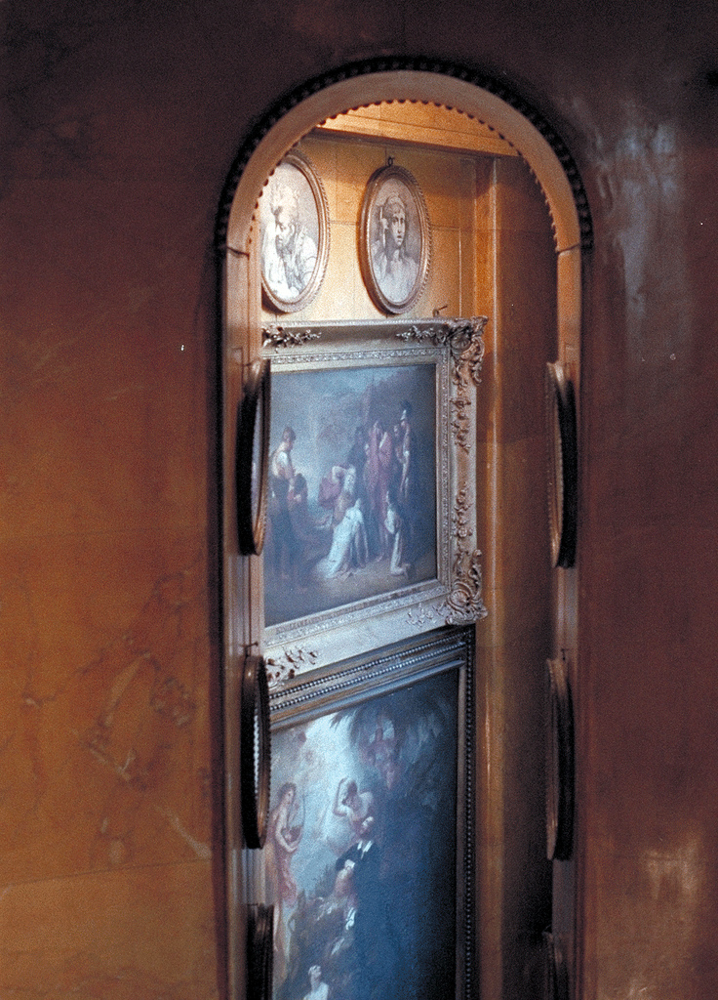

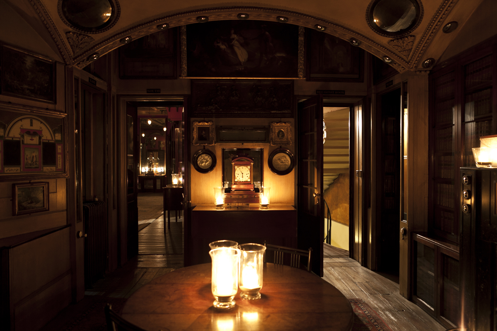

