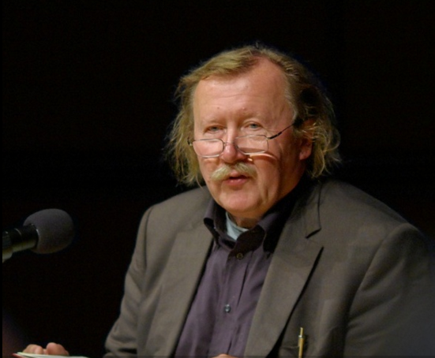

## Sloterdijk

RELATED TERMS: 

 

Photograph: Rainer Lück http://1RL.de – 17 July 2009 – Used under CC BY-SA 3.0 licence

>“Humanity becomes a political concept. Its members are no longer travellers on the ship of fools that is abstracted universalism, but workers on the consistently concrete and discrete project of a global immune design.” (Couture, 2016: 73) 

The work of German philosopher Peter Sloterdijk (1947-) has direct relevance for the design and analysis of narrative environments. As with all theorists, his work may be considered to constitute a particular kind of text-based narrative environment as well as a particular kind of environmental discourse (i.e. discourse about the environment and environment as discourse and as apparatus) **[1]**.

Sloterdijk argues, following through on the initial Heideggerian insight, that Dasein (there-being or here-being), i.e. ‘being thrown into the world’, is to be thrown into an envelope of some kind, To define humans is to define the envelopes, the life support systems, that make it possible for them to breathe, to live. Furthermore, all of the envelopes or life support systems into which people are born (‘thrown’) are artificial, constructed, designed. These envelopes are called ‘spheres’ by Sloterdijk, and the study of them he calls spherology.

It would be very fruitful, from the point of view of designing a narrative environment to engage with Sloterdijk’s theory of spheres, bubbles and foam, i.e. different scales of envelope, as processes of environing, immersing and insulating (from hostility and danger) which are folded and/or embedded into one another, potentially in the form of a knot or a torus or a “strange loop” (Hofstadter, 1979).

Sloterdijk also suggests that human beings oscillate between the desire to be embedded (immersed, insulated) and the desire to break free (transgress, flow, mingle). Nevertheless, this ‘breaking free’ is a process of moving from one envelope to another, wherein may be found further or other life support systems.

It could also prove fruitful to relate Sloterdijk’s enfolded -spheres to Gerard Genette’s notion of diegetic levels in a narrative, which also implies processes of framing or embedding, in order to complement narrative complexity with environmental complexity: stories within stories within environments within environments.

This may also yield an interesting way of exploring the processes of metalepsis **[2]**, wherein the boundaries or borders between levels or spheres or ‘worlds’ of narratives and of environments are transgressed, so that one level or sphere, which does not seem to belong there, emerges or appears within another in a disruptive manner. This may also enable a development of the argument, as expressed for example by Ryan (2006), that there are two main types of metalepsis: rhetorical, as discussed by Genette; and ontological, as discussed by Brian McHale.

**Notes**

**[1]** For a lengthier discussion of Sloterdijk and narrative environments, see [Parsons (2016, 28 Feb)](http://prolepsis-ap.blogspot.co.uk/2016/02/sloterdijk-and-narrative-environments.html)

**[2]** For a comprehensive discussion of metalepsis, see Pier (2013).

**References**

Couture, J.-P. (2016) _Sloterdijk_. Cambridge, UK: Polity.

Hofstadter, Douglas (1979). _Gödel, Escher, Bach: an Eternal Golden Braid_. New York: Basic Books.

Latour, B. (2009a). A Cautious Prometheus ? A few steps toward a philosophy of design (with special attention to Peter Sloterdijk ). In: Hackney, F., Glynne, J., and Minto, V., eds. _Networks of design: proceedings of the 2008 Annual International Conference of the Design History Society_. Boca Raton: Universal Publishers. Available from http://www.bruno-latour.fr/sites/default/files/112-DESIGN-CORNWALL-GB.pdf [Accessed 10 August 2012].

Latour, B. (2009b). Spheres and networks: two ways to reinterpret globalisation. _Harvard Design Magazine_, 30 138–144.

Pier, J. (2013). Metalepsis. _The Living handbook of narratology_. Available from [http://wikis.sub.uni-hamburg.de/lhn/index.php/Metalepsis](http://wikis.sub.uni-hamburg.de/lhn/index.php/Metalepsis) [Accessed 28 February 2016].

Parsons, A. (2016, 28 Feb). Sloterdijk and Narrative environments. _Poiesis and Prolepsis_ [Blog], 28 February. Available from [http://prolepsis-ap.blogspot.co.uk/2016/02/sloterdijk-and-narrative-environments.html](http://prolepsis-ap.blogspot.co.uk/2016/02/sloterdijk-and-narrative-environments.html) [Accessed 28 February 2016].

Ryan, M.-L. (2006). Metaleptic machines. In: _Avatars of story_. Minneapolis, MN: University of Minnesota Press, 204–230.

Sloterdijk, P. (2011). Architecture as an art of immersion. _Interstices_, 12, 105–109\. Available from [http://interstices.ac.nz/wp-content/uploads/2011/11/INT12_Sloterdijk.pdf](http://interstices.ac.nz/wp-content/uploads/2011/11/INT12_Sloterdijk.pdf) [Accessed 9 January 2016].

