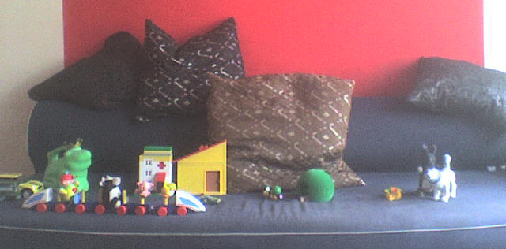
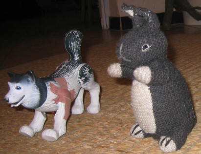

## The Sofa

RELATED TERMS: 

On the sofa 1

In one sense, The Sofa is the physical world where the physical Mr Dog and Rabbit hang out with their friends and relations and associated trains, cars, houses, floating chairs and so on. Most of what happens is fairly mundane, including floating. 

In another sense, The Sofa is the diegesis (diegese; world of the story) of a framing narrative in which smaller narratives are acted out. Mr Dog and Rabbit have a [parallel existence in ‘story’ narratives](http://www.stuartjones-wawamoz.com/essays/Louis-Mr-Dog-and-Rabbit.html), where they have a house in the suburbs and a group of friends, most of whom live near the Natural History Museum. 

This parallel world is further paralleled in Hairyland.

Mr Dog and Rabbit. Rabbit: ‘Hey! that’s not my good profile!’

