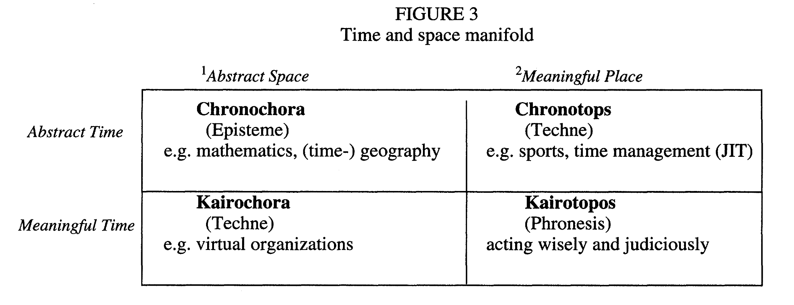

## Space

**RELATED TERMS: [Place](https://github.com/narrative-environments/CourseCompendium/blob/main/Place.md);**

Space is abstract, in contrast to place, which is concrete. Nevertheless, both space and place are capable of acting in a narrative environment, of being actants.

A location or a site is a space that does not have placeness or placiality.

Stewart, Gapenne and Di Paolo (2010: ix) argue that, 

"we put the world together in a spatial sense through movement and do so from the very beginning of our lives. Spatial concepts are born in kinesthesia and in our correlative capacity to think in movement. Accordingly, the constitution of space begins not with adult thoughts about space but in infant experience." 

Futhermore, they state that, "the constitution of a “kinesthetic function”, itself rooted in proprioception, is foundational for the emergence of the prereflective experience of spatiality and distal objects."

**Discussion:**

How useful might the ancient Greek notions of _chora_ and _topos_, alongside the two ancient Greek conceptions of time, _kairos_ and _chronos_, be in developing an understanding of how time and space can be configured in the design of narrative environments, moving from the relatively abstract to the more experientially meaningful? Perhaps Hans Ramo's (1999) diagram might be of value on this context:

Source: Hans Ramo, _An Aristotelian human time-space manifold_

In this case, the design of narrative environments might be considered to be concerned with the creation of a 'kairotopos' as a place of meaningful time and meaningful space, where one might learn to develop 'phronesis' or 'practical wisdom'.

## Space in Narrative Ecology

A space can be defined as an actor [Actant] embodied in the virtual or physical built environment, and therefore exerting a presence that can be defined in terms of a spatial analysis of light, volume, obstacles and flow routines, amongst others, which themselves give rise to certain affordances or possibilities for other 'actants', including people.

**References**

Ramo, H. (1999) ‘An Aristotelian human time-space manifold: from chronochora to kairotopos’, _Time & Society_, 8(2–3), pp. 309–328. doi: 10.1177/0961463X99008002006.

Stewart, J., Gapenne, O. and Di Paolo, E. A. (eds) (2010) _Enaction: toward a new paradigm for cognitive science_. Cambridge, MA: MIT Press.

