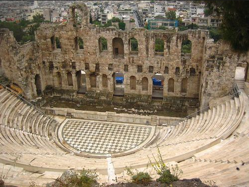

## Tragic theatre - Aristotle

**RELATED TERMS: Epic theatre - Brecht; Theatre of Cruelty; Theatre; Arendt; Mimesis; Story (fabula) and Plot (sjuzet or sjuzhet)**

The importance of tragic theatre for narrative environment design is threefold. First, it places great importance on plot construction and the effects upon the audience that such plotting can achieve. Second, it emphasises the importance of engaging an audience empathically, in relation to plot construction, in the context of moral and intellectual education. Third, like drama, the narrative in a narrative environment is embodied and enacted, woven into an experiential, intercorporeal, spatio-temporal framing. Much, therefore, can be learned about the design of a narrative environment from the construction of a drama. Engagement with and participation in narrative environments, like drama, involves the weaving together of emotional and intellectual responses, together with reflection upon those responses.

The Western tradition of dramatic construction has been dominated by the Aristotelian conception of tragic drama. This was critically re-articulated by Bertolt Brecht, through his conception of epic theatre; and by Antonin Artaud, with his conception of a theatre of cruelty. The Aristotelian model has been further destabilised by the disruption of plot by the insertion of elements of reflexivity, the inclusion of devices that point to the deliberate constructedness or artificiality of the drama’s narrative, such as in the theatre of the absurd, and by the implications this has for the participant/audience. These points are taken up elsewhere in the MANE Compendium, for example, in the entries for Epic theatre (Brecht), Defamiliarisation and Protagonist.

Tragic theatre, as conceived by Aristotle, then, is important not just for its emphasis on plotting but also for its concern with the emotional and intellectual effects upon the participants and the proximity or distance which the participants are granted in relation to the narrative events unfolding. Questions which arise focus on whether the Aristotelian approach encourages critical thinking on the part of the audience, or simply delivers aesthetic pleasure as an end in itself, through catharsis; whether it permits an understanding of the social conditions of the protagonist’s actions, rather that a narrow focus on individual decision-making and action within a universal, ideal conception of the human condition; and whether the emphasis on emotional engagement helps or hinders the audience’s intellectual understanding of the drama’s significance and meanings.

Theatre of Dionysus at Pompeii

Greek tragedy was a popular and influential form of drama performed in theatres across ancient Greece from the late 6th century BCE (Cartwright, 2013). Working inductively, Aristotle developed his theorisation of tragic theatre from the works of Aeschylus, Sophocles and Euripides.

Aristotle’s theorisation of tragic theatre is framed by wider debates in the Ancient Greek world about the role of the art-work (poiesis, making, work; a form of poietic production) and the emotions in moral and intellectual education. The central issue for tragic theatre is whether emotional engagement with the characters in the drama help or hinder the audience’s critical intellectual reflections on the characters and situations represented in the work. For Plato, the emotions that tragedy evokes in the audience disables them intellectually and leads them astray morally (Curran, 2001: 167) Aristotle, at least in the interpretation of his work proffered by Martha Nussbaum and Stephen Halliwell, values tragic drama because it elicits emotions that work in conjunction with a cognitive understanding of ourselves as human beings and of the world in which we live (Curran, 2001: 167-168).

Curran (2001) brings into sharp focus Aristotle’s view, first, that plots must feature individual error and a morally admirable protagonist; and, second, that engaging with the thoughts and feelings of the tragic protagonist is central to responding to tragedy. These practices, as Aristotle describes them, do not permit drama that is socially critical, unless they are supplemented by other devices that link the action of the protagonist to a larger social nexus. In this respect, Brecht’s recommendations for dramatic construction are useful for supplementing the failings in Aristotle’s preferred dramatic practices.

For Aristotle, tragedy has a final purpose or end, i.e. telos, which is to be an imitation or representation, i.e. mimesis, of action and human life. While Aristotle links mimesis to similarity, he argues, against Plato, that the artist/playwright does not just _copy_ the shifting appearances of the world. Rather, the artist/playwright imitates or _represents_ reality itself, and gives form and meaning to that reality. This mimesis is associated by Aristotle with a characteristic pleasure, that of experiencing the catharsis, i.e. relief from of purification of, of the pity and fear evoked by the tragic events. In addition, response to mimetic works involves, for Aristotle, a certain kind of emotional or intellectual learning, although he does not elaborate upon this learning nor, indeed, does he expand in detail upon what catharsis involves.

While Aristotle distinguishes six elements of tragedy, i.e. plot, characters, verbal expression, thought, visual adornment, and song-composition, the basic principle of tragedy for Aristotle is plot, or the imitation (mimesis) of action. For an action to be tragic, it must incorporate features capable of eliciting pity and fear to effect a catharsis of these emotions in the audience. Aristotle evaluates plot construction on the basis of which plot patterns best evoke the emotions of pity and fear. Aristotle’s account of tragedy and why it affects the audience appeals to a universal essence of human nature, such that the definition of certain events will elicit a response of pity and fear in anyone who witnesses the dramatisation.

Aristotle’s approach to tragedy is therefore essentialist in two respects: it is based on an account of plot as the inherent nature of tragedy; and it assumes a universal or idealised spectator, who will respond with pity and fear when witnessing the appropriately depicted suffering of the tragic protagonist. The best tragic plots in Aristotle’s view are those which show harm occurring, or about to occur, to kin or loved ones due to the tragic character’s not knowing what he or she is doing.

In Aristotle’s ideal tragic drama, then, the protagonist is basically a good person, a person ‘intermediate in virtue’ (Curran, 2001: 174), who brings about, or threatens to bring about, his or her own misfortune and those of his or her kin or loved ones, but who acts in ignorance of what he or she is doing. The suffering brought about is far greater than any error the character might have committed, and it is this which allows the audience to feel pity and fear for him or her, a protagonist who, as ‘someone like ourselves’, we, the audience, can empathise and sympathise.

As a caveat, it should be noted that Aristotle draws on the class and gender hierarchies outlined in his _Politics_, such that, in his view, the goodness of a woman should be represented as inferior and the sufferings of a slave are not worthy of representation at all. Tragic characters, in other words, are male and are members of the aristoi or the oligoi, the noble or the wealthy classes.

For further thoughts on the value of tragic theatre for narrative environment design, see [Pedagogic journeys 1\. Tragic drama as narrative, learning environment](http://prolepsis-ap.blogspot.co.uk/2016/12/pedagogic-journeys-1-tragic-drama-as.html)

**References**

Aristotle (2000). _The Poetics of Aristotle_, translated by H. Butcher. Pennsylvania, PA: Pennsylvania State University. Available from [http://weltordnung.ch/books/Aristotle – Poetics.pdf](http://weltordnung.ch/books/Aristotle - Poetics.pdf) [Accessed 5 August 2013].

Cartwright, M. (2013). Greek tragedy. _Ancient History Encyclopedia_. Available from [http://www.ancient.eu/Greek_Tragedy/](http://www.ancient.eu/Greek_Tragedy/) [Accessed 19 March 2016].

Curran, A. (2001). Brecht’s criticisms of Aristotle’s aesthetics of tragedy. _Journal of Aesthetics and Art Criticism_, 59 (2), 167–184\. Available from [http://www.jstor.org/stable/432222](http://www.jstor.org/stable/432222) [Accessed 25 June 2016].

