## Tränenpalast Berlin

**RELATED TERMS: Museums; **

**Tränenpalast Berlin: a narrative environment. Suggested by Isabel Vegas Gómez, October 2017**

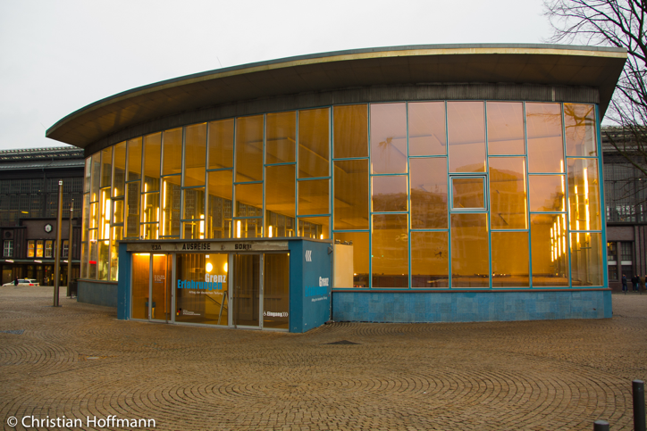

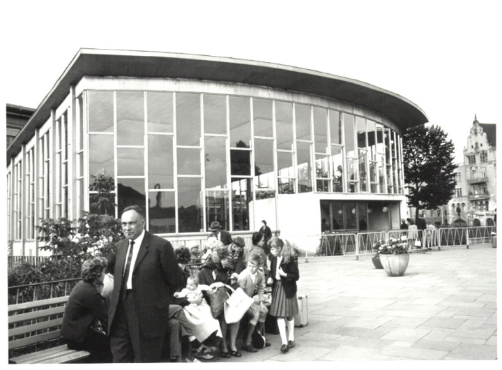

**Background**

The Tränenpalast or “The Palace of Tears” was built in 1962, one year after the Berlin Wall was erected. It served as a Checkpoint and customs control for the border crossing between East and West Berlin. It stood within the train station of Friedrichstraße, as an anteroom prior to entering the station itself. Only West-Berliners could make use of this border crossing in order to enter and return from the GDR, as leaving the Soviet sector was wholly forbidden for the citizens of East-Berlin. The name “Palace of Tears” comes from the tearful farewells taking place in its premises. The Soviet government wanted to make the experience of crossing to East Berlin as unappealing as possible.

After the fall of the Iron Curtain in 1989, the building was abandoned and used as a club until 2008 when it was included in the Federal Memorial Sites. In 2011, the building was finally turned into a museum.

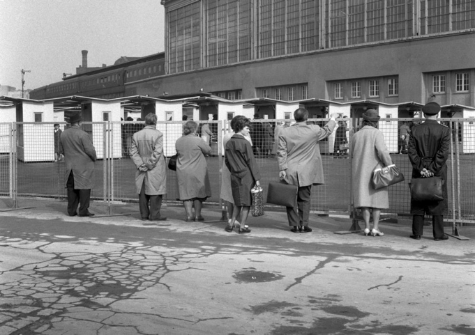

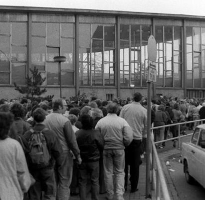

**The Argument**

I argue that this exhibition transcends the standard display of visuals and facts of an average exhibition and is a genuine example of a narrative environment. While remaining accurate in its historical narration, the path through the exhibition nevertheless plays with the visitor’s feelings from the entrance/beginning to the exit/end, with an emotional journey that moves from pity, empathy and desolation to nostalgia, humour and empowerment.

I think that this exhibition is a Narrative Environment instead of a bare exhibition for several facts:

–It is felt as a journey through space and time. There are several thresholds and you get close to feeling how the same journey was experienced twenty years ago.

–It plays with the line of feelings, prompting different sensations that will make you empathic yet critical, maintaining the visitor’s curiosity throughout the trip.

–It is critical: it does not present itself just as “communism is bad”. It opens the dialogue about the idea of frontier and fenced areas and its survival in many other regions of the world. It creates awareness of what is suffered in hot-frontiers and the ambivalent difficulties of crossing them.

–Design-wise, it has been enlivened carefully, not romanticising the past but offering a feeling of how it looked and for what purposes, whilst keeping it updated through new exhibition techniques and information sharing.

**The journey**

When entering you immediately have to descend some stairs, being through the architecture that you are travelling towards a sort of underworld/other world.

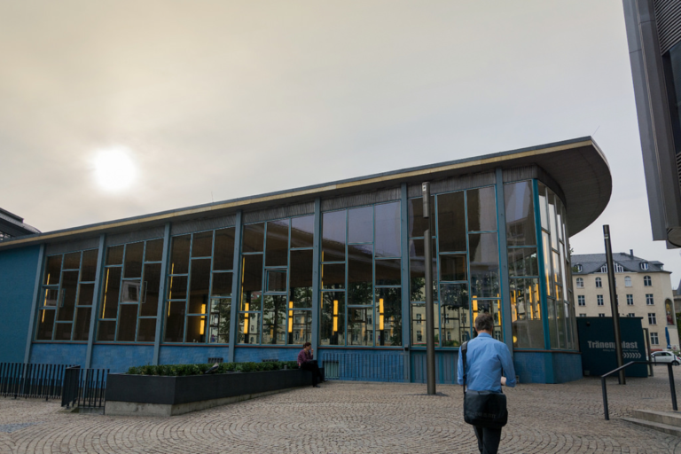

The tiles of the floor and ceiling have been preserved, so again you are travelling through the architecture to the past which, as the saying goes, is another country.

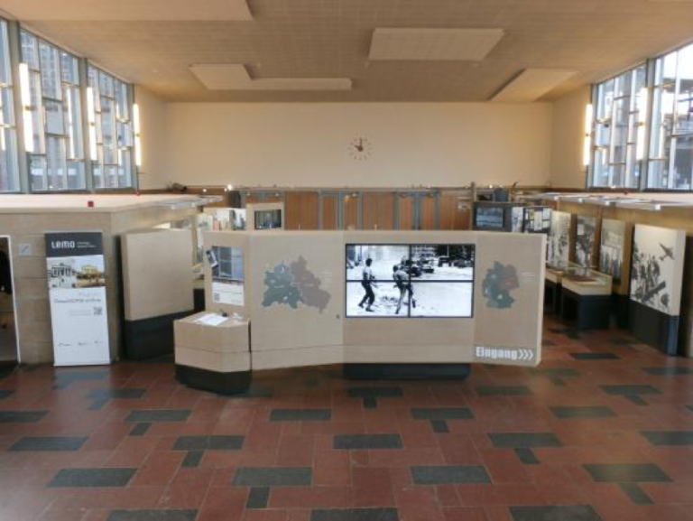

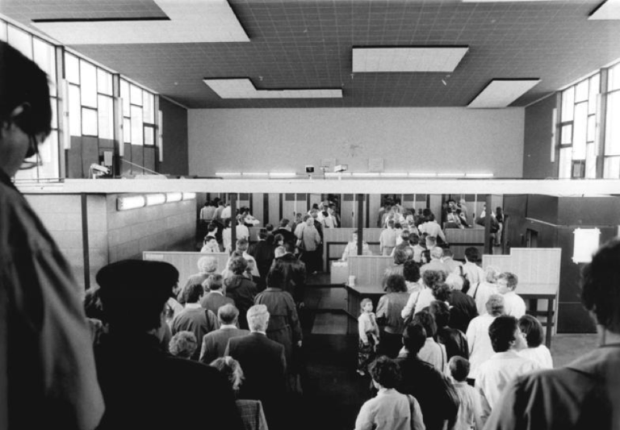

After being introduced to the context of the divided city and the Cold-War tensions, the visitor starts the journey that the West-Germans had to follow in order to arrive to the final threshold, the train station.

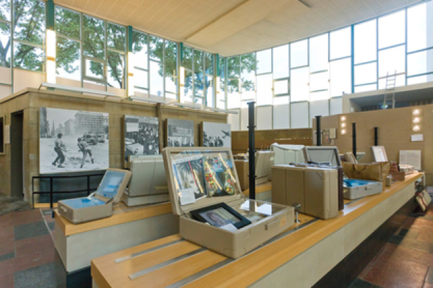

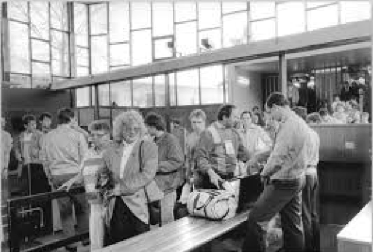

A very interesting point of the exhibition is the model of the pathway that people needed to follow in order to cross to East-Berlin, where you can see all the intricate steps necessary to pass the border.

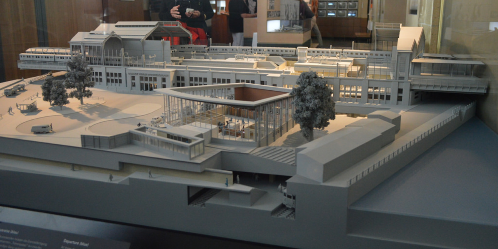

During your walk through the space, there is a clear material language. Everything is displayed over concrete blocks, in black and grey colours, as a way of transmitting the tone of voice of the space.

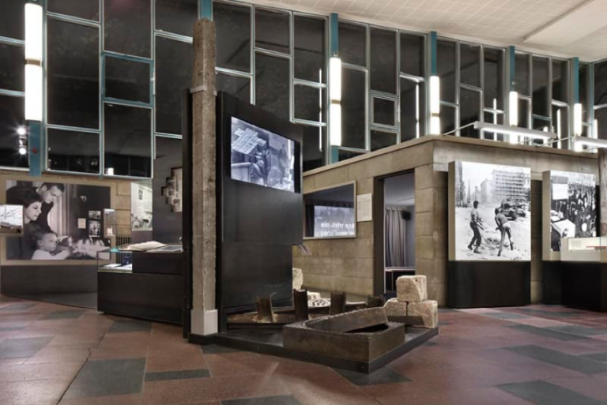
 
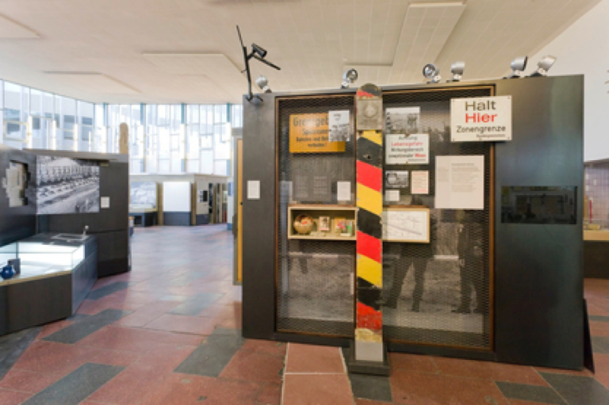

The exhibition also contains elements of humour, such as the stories hidden in the re-creation of an “intershop”, where you can discover the “undesirable items” trafficked from the Western to the Eastern sector, such as magazines and bananas.

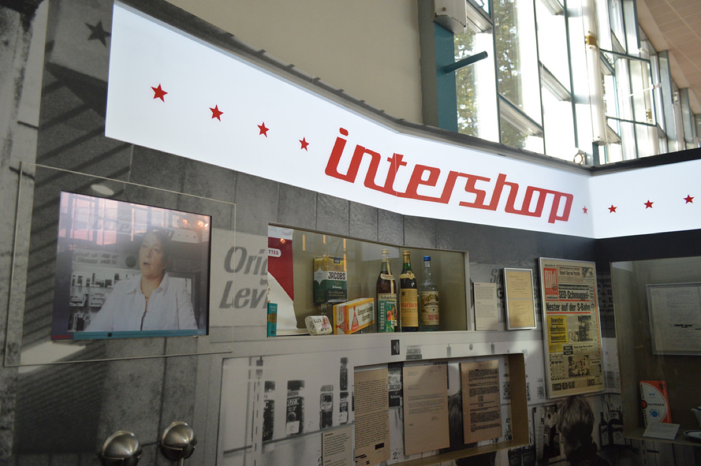

Overall, the emotional journey of the museum may be mapped as follows:

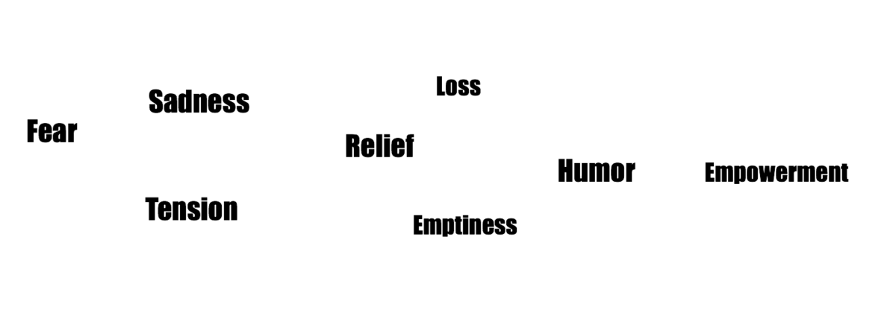

