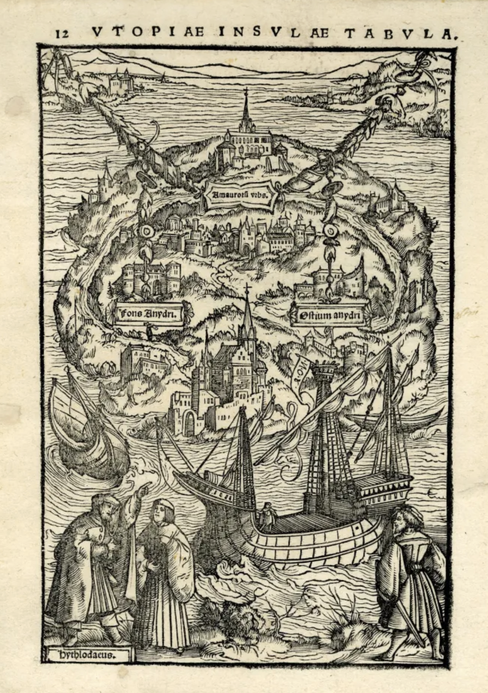

## Utopia and Utopian thinking

**RELATED TERMS: Avant-garde movements; Modernism; Design practice and functionalism**

Woodcut map of Thomas More’s Utopia by Ambrosius Holbein.

Sir Thomas More published his _Utopia_ in 1516 . The word ‘utopia’ combines two Greek roots, _ou-_ meaning _‘_no’ and _topos_ meaning ‘place’, hence literally utopia is a no-place, a non-existent place or nowhere. However, embedded within the word utopia is a pun. The near-identical Greek word _eu-topos_ means a ‘good place’.

In creating such a concatenation, More was highlighting the question of whether and, if so, how a good place (eutopia), currently non-existent or nowhere to be found (utopia), can be created (brought into existence) and established (sustained).

Utopian thinking is an important element of modernism and of avant-garde practices, and is therefore is great important for the design and understanding of narrative environments and what any specific narrative environment is seeking to accomplish and how it is seeking to do so.

**References**

British Library (No date). Utopia. _British Library Learning_. Available from [http://www.bl.uk/learning/histcitizen/21cc/utopia/utopia.html](http://www.bl.uk/learning/histcitizen/21cc/utopia/utopia.html) [Accessed 25 June 2016].
