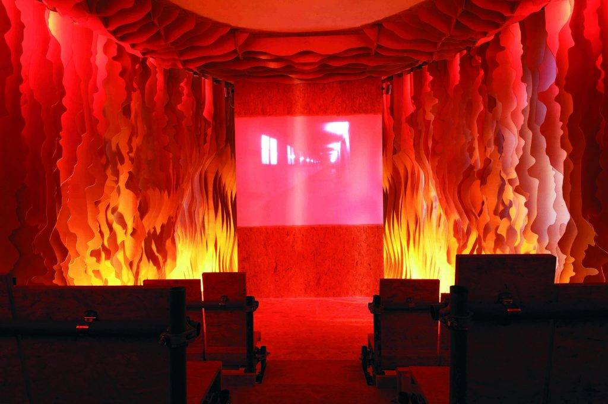

## Venetian, Atmospheric

RELATED TERMS: 

Venetian, Atmospheric by [Thomas Putrih](http://putrih.net/venetian-atmospheric) was shown at the 52nd Venice Biennale, Slovenian Pavilion, San Servolo, Venice, 10 June – 21 November 2007.

It is both an architectural project and a sculpture, a viewing machine meant to create and encourage perceptual illusions. Its title is a homage to architect John Eberson’s atmospheric cinema interior design of the 1920s. It gave the spectators the impression that they were sitting under a nocturnal sky in an exotic site. With biomorphically curved wooden walls and a ceiling with twinkling stars and moving clouds, Putrih’s cinema immerses the spectator in an ever-changing environment, ready to give space to the cinematic illusions projected in it.

Photograph by Michele Lamanna

