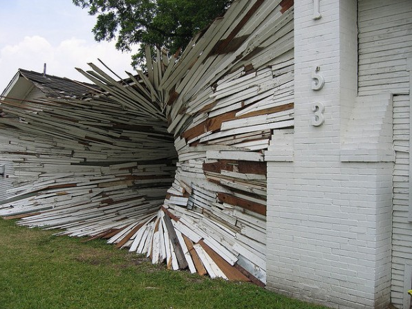
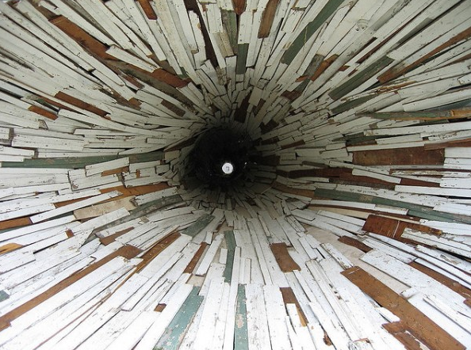
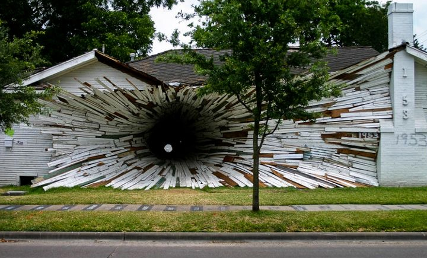

## Vortex house

RELATED TERMS: 

In 2005, Art League Houston had two decaying studio houses that were soon to be replaced by a new building. Prior to demolition, the two homes were given to sculptors Dan Havel and Dean Ruck.

Havel and Ruck created a large funnel-like vortex beginning from the west wall adjacent to Montrose Boulevard. The exterior skin of the houses was peeled off and used to create the narrowing spiral as it progressed eastward through the small central hallway connecting the two buildings and exiting through a small hole into an adjacent courtyard.

