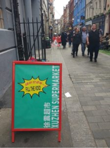
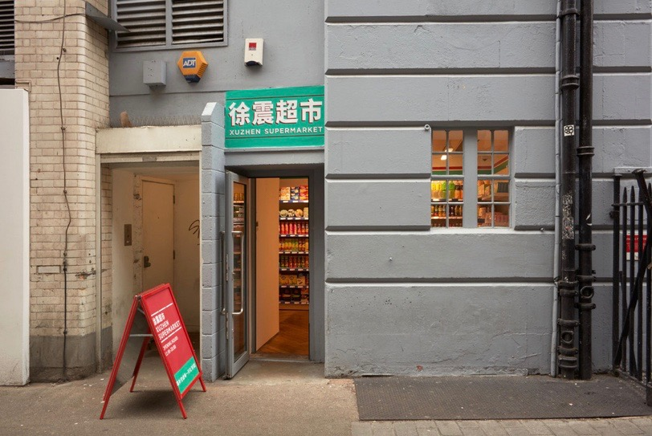
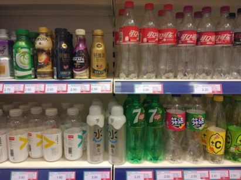
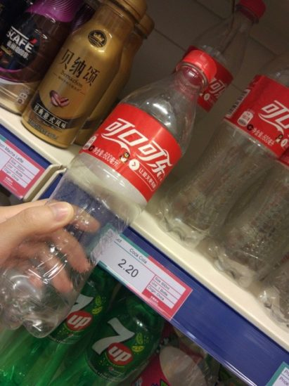
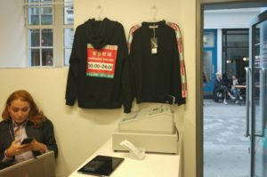
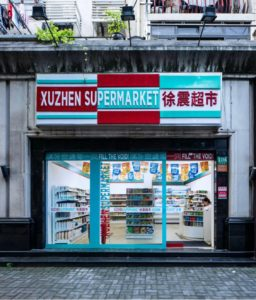
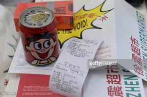

## Xu Zhen Supermarket

RELATED TERMS: 

Xu Zhen Supermarket, suggested by Tongyao Guan, December 2017

From 21 September to 5 November 2017, Sadie Coles HQ gallery and curator Victor Wang presented Shanghai-based artist Xu Zhen’s XUZHEN Supermarket (2007-2017) for the first time in the United Kingdom. It has previously been presented in Shanghai, Singapore, New York and Miami.

It looks just like a normal supermarket from the outside, although a billboard at the entrance with the slogan slogan “FILL THE VOID”, gives the passer-by pause for thought. Something may not be quite as it should be. After entering the supermarket, the inside is also just like a normal supermarket, with products on the shelves and a cashier.

It is only when the visitor walks up close to the products that they are surprised to find that there is nothing inside the transparent containers. The bottles of drinks are empty. At that point, the visitor is prompted to check the other items with opaque packaging. The shampoo bottles, instant noodles, soaps … also have nothing inside.

The visitor then recalls the slogan, FILL THE VOID, and the meaning of this pseudo-shopping experience begins to become clearer: rather than simply buying products, when we are shopping we are actually seeking to fill the void of our everyday lives and responding to our mental needs.

The installation is a critical reflection on capitalist products and processes. The artist, Xu Zhen, invites audience to invest in empty shells, containers bereft of substance or use value, the venture offers a critique of the often-destructive nature of global capitalism – its relentless cycles of supply and demand, brute logistics and mass consumption, and the aesthetic guises it assumes through branding and packaging. With the hollow vessels, there is also a satirical metaphor for the international art market and its arbitrary ascriptions of value.

When the artist opened this supermarket in an old community in Shanghai, where an older, more traditional, generation is living, they came to the supermarket without an art knowledge background but with the purpose of shopping for daily purchases. They left confused and disappointed, without buying anything. This is one kind of audience. Another kind of the audience, art lovers who came with advance knowledge and an aesthetic purpose, purchased those empty products as art works, and left with them as well as the receipt as proof of purchase and provenance.

The artist, Xu Zhen, uses an ordinary supermarket to deliver a non-instrumental message to the audience. The audience bring their own prior experience and knowledge of this kind of environment. Some see a supermarket and are surprised to find that the familiar has become strange, challenging their knowledge and past experience. Others see an art gallery, and play along with, and into, its conceit (supermarket = art gallery = art supermarket), congratulating themselves for being part of a knowledgeable elite.

**References**

Sadie Coles HQ (2017). ZHUZHEN Supermarket. Sadie Coles. Available at HQ. [http://www.sadiecoles.com/exhibitions-press-release/xu-zhen-supermarket-21-september-04-november-2017](http://www.sadiecoles.com/exhibitions-press-release/xu-zhen-supermarket-21-september-04-november-2017) [Accessed 20 December 2017]

